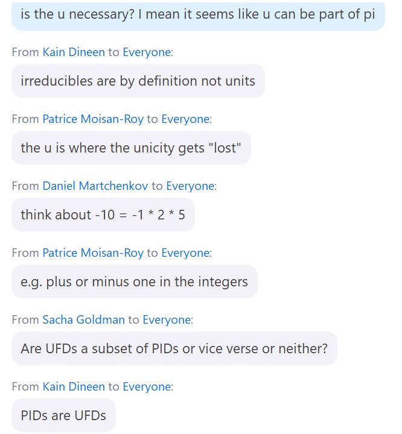
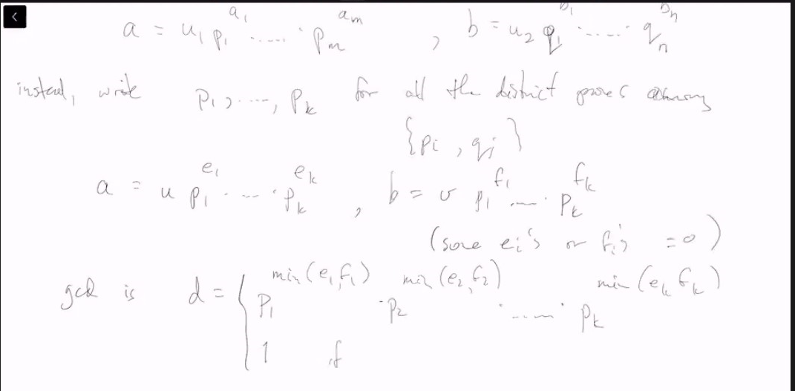

# Lec 29
### Definition: Unique Factorization domain
* is an integral domain $R$ in which every non-unit $r \neq 0$
  * can be factored into $r = u p_1^{a_1} p_2^{a_2}...p_n^{a_n}$ 
    * which $p_i$ is irreduciable 
    * and $u$ is a unit
      * $p_i$ s are distinct
  * Moreover, this decompsition is unique 
    * up to order and multiplication by units
    * i.e.  if $r = u p_1^{a_1} p_2^{a_2}...p_n^{a_n} = v q_1^{b_1}...$
      * then $m=n$
        * and for each $i$ there is $j$ s.t. $p_i = u_i q_j$ ($u_i$ a unit)
  * the $u$ in definition is important
  * 
### Example:
* consider $R = Z[2i]$ is integral domain but not ufd
  * 

### Theorem: UFD has prime iff irreducible
* In a UFD, prime $\iff$ irreducible
* Proof. $\rightarrow$ is done
* $\leftarrow$
  * suppose $p$ is irreducible, suppose $p|(ab)$
    * i.e. $ab = pc$ for some $c$
    * then $pc = a \times b = p_1...p_n \times q_1...q_m$
      * $p | pc = (p_1...q_m)$
      * which implies $p$ equal one of $p_1,p_2...q_m$ up to a unit
      * WLOG $p = up_1$, since $p_1 | a$, thus $u^{-1}p = p1 | a$
        * thus $p | a$

### Theorem: We can have GCD on UFD
* write the factorization $p_1,...p_k$ for all distinct primes among $\{p_i, q_i\}$

### Theorem: (ED =>)  PID is a UFD
* Pf;
  * suppose $0 \neq r$ non-unit
    * if $r$ is irreducible, then we are done
    * Suppose $r$ is reducible, then $r = r_1 * r_2$ 
      * if both irredicuble then we are done
      * otherwise we continue factoring reducibe factors
        * but we have to prove that this process terminates
    * if $r = r_1r_2$, then $(r) \subsetneq (r_2)$
      * if you keep factoring, you get a strictly increasing chain of ideals
        * suppose it is non-terminating, then you have a infinite chain
        * $(I_1) \subsetneq (I_2) \subsetneq (I_3) ... $
        * Cosnider the $I:= \bigcup_1^\infty I_j$ which of course is an ideal
          * since we are in PID, $I = (a)$, but that means there is $i$ s.t. $a \in I_i$
            * and thus $(I_i) \supseteq I$ thus $(I_i) = I$ 
            * a contradiction that $I_{i+1} \supsetneq I_i$.
***
* Then we need to show uniqueness of factorization
  * Induction: on the number of irreducible when I factor $r = p_1...p_n$
    * if $n=0$, then $r$ is a unit
    * if $r=uq_1q_2...q_m$ then $q_1 | r$
      * We can continue the argument as above so $q = vp_1$
      * thus $r = p_1...p_n = uvp_1q_2...q_m$ 
        * then applies induction hypothesis
* 

### Corollary: $\mathbb{Z}$ is a UFD
### Corollary: ED is a UFD
### Example
* $\mathbb{Z}[x]$ is a UFD but not a PID
* $F[x]$ is a UFD
* $K$ a UFD, $K[x]$ is still UFD

***
### Example: 
* Gaussian Integers 
  * $\Theta = Z[i] = \{a + bi : a, b \in Z\}$
  * $N(a+bi) = (a+ib)(a-ib) = a^2 + b^2$
    * and $Z[i]$ is Euclidean Domain
  * Suppose $r \in Z[i]$ is s.t. 
    * N(r) = $\pm$ 1
      * has to be 1
  * so when $1 = r\overline{r}$ implies $r$ is a unit
  * Coversely,
    * if $r$ is a unit, then $\exists r'$ s.t. $rr' = 1$
      * which means $N(r)N(r') = 1$ and thus $N(r) = 1$
### Lemma:
* In $Z[i]$, $r$ is a unit iff $N(r) = 1$
***
* Now suppose $\alpha \in Z[i]$ and $N(\alpha) = p$, a prime
* if $\alpha = \beta \gamma$, then $p = N(\beta)N(\gamma)$
  * WLOG $N(\beta) = p$, $N(\gamma) = 1$, which means $\gamma$ is a unit
  * that means $N(\alpha) = p$ means $\alpha$ is irreducible

***
* Suppose $\pi \in Z[i]$ is a prime  i.e. $(\pi)$ a prime ideal
* then $(\pi) \cap Z$ an ideal in Z
#### Claim: $(\pi) \cap Z$ is prime ideal in Z
* Proof. If $a, b \in Z$, $ab \in$ $(\pi) \cap Z \subseteq (\pi)$
    * wlog $a \in (\pi)$ thus $a \in (\pi) \cap Z$
***
* So  $(\pi) \cap Z = (p)$ as $Z$ is a PID, some prime $p \in Z$
* $p \in (\pi)$ and thus $\pi | p$ in $Z[i]$, say $p = \pi \pi'$
* $N(p) = p^2 = N(\pi)N(\pi')$, only three poss:
  * 
  * If $N(\pi') = 1$, then $\pi'$ is a unit, so $p = \pm \pi, \pm i \pi$
  * If $N(\pi) = N(\pi') = p$, then $p = \pm \pi \pi', \pm i \pi \pi'$
    * and $\pi,\pi'$ are both primes, 
      * a prime in Z splits in a larger ring?
#### Question: (Tje following is on P290, this note is bad)
* For which primes $p$ can be written as a sum of two squares? $p = a^2+b^2$
* If $p = a^2 + b^2$, i.e. $p = (a+ib)(a-ib)$ are both irreducble in $Z[i]$
  * if $p$ is not a sum of two squares, then $p$ is irreducible in $Z[i]$
    * by the argument above
***
* Suppose we look at $Z/pZ$ and also in $Z/4Z$
  * in $Z/4Z$, squareas are ony $0,1$
  * $2^2 \equiv 0 \mod 4$, $p^2 \equiv 1 \mod 4$ for any odd prime $p$
  * $a^2 + b^2 = 0,1,2 \mod 4$ but no 3 $\mod 4$
  * => if prime $p \equiv 3 \mod 4$, then $p \neq a^2 + b^2$
  * => if $p \equiv 3 \mod 4$ then $p$ is irreducible in $Z[i]$ (??)
#### Lemma: (P291)
* If $p \in Z$ is prime, then 
  * $p | n^2 + 1$ some $n \in Z$
  * iff $p=2$ or if $p \equiv 1 \mod 4$
* pf. 2 = 1^1 + 1
  * if $p \equiv 1 \mod 4$, then to show $p | n^2 + 1$ we need $n^2 \equiv -1 \mod p$
  * The image of $n$ in $(Z/pZ)^\times$ has order 4
  * Lagrange's Theorem => $(Z/pZ)^\times$ has an element at order 4 then $4 | (p-1)$
    * and $m^2 = 1 \mod p$, then $p | m^2 - 1 = (m+1)(m-1)$ thus $m=\pm 1$ in $Z/pZ$
      * since -1 is the only element of order 2 in $(Z/pZ)^\times$, so $m = -1$
***
* $(Z/pZ)^\times$ contains a subgroup of order 4
  * can't be Klein-4 group because it has 3 elements of order 2
* SO $(Z/pZ)^\times$ contains an element of order 4
***
* if $p \equiv 1 \mod 4$, then there is $n \in Z$ s.t. $p | (n^2 + 1)$ 
  * if $p$ were irreducible in $Z[i]$, say $p | (n+i)$,
    * but then $p | (n+1), p | (n-1)$  as $p$ is real and divides each of them
    * then $p | n+i - (n-i) = 2i$ a contradiction 
  * So $p$ is reducible

### Fermat's Theorem: $p=a^2 + b^2 \iff p = 2 \lor p \equiv 1 \mod 4$
* and if it can, then $a,b$ is unique up to $\pm$ and order
***
### Note: 
* if $m = a^2+b^2 = N(a+ib), n = c^2 + d^2 = N(c+id)$
  * then $mn = r^2 + s^2 = N((a+ib)(c+id))$
* $m$ is a sum of two square iff $mt^2$ is
* Given $n \in N, n = 2^w p_1^{a_1}...q_l^{b_l}$
  * where $q_i = 3 \mod 4, p_1 = 1 \mod 4$
  * if $b_i$ is even for all $i$ then $q_1^{b_1}...q_l^{b_l}$ is a square and irrelevent
  * only focus on $2^2...p_k^{a_k}$, devided by even powers we can assume $a_i = 0$ or 1
  * say $n=2^wp_1...p_r =$ sum of 2 squares
  * so this concludes something, and this holds conversely