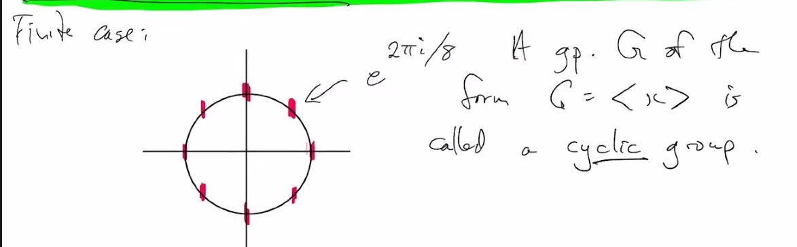

# MAT347: Algebra
### Definition:  Coset: 
* For $H < G$, left coset $xH$, $x \in G$
  * given $x, y \in G$, either $xH = yH$ or totally disjoint
* $G = \sqcup_{i} x_i H$
* if we know $|H|$ and $|G|$
  * then number of cosets is $\frac{|G|}{|H|} = [G : H]$, it is sometimes not cadinality divison, this is called **index**
    * e.g. $G = \ints, H = n \ints$; $[G: H] = n$

***
* Suppose $G = <x> = \{e, x, x^2 ... \}$
* Finite case:
  * 

### Definition: Cyclic Group:
* A group $G = <x>$ is called a cyclic group 
  * cyclic group can be infinite, for example integers
  * recall that generator is defined to be the smallest subgroup containing something

***
* Generally speaking,
  * left & right cosets are different
  * of course if $G$ is commutative, they are the 
  * But in the triangle gproup, $G = <p, \sigma>$
    * if $H = <\sigma> = \{e , \sigma\}$ what are the cosets?
      * $eH, pH, p^{-1}H$
      * What about $p\sigma H$? It is actually $\{p\sigma, p\} = pH$
  * left cosets are $eH = H, pH, p^{-1}H$
* What about Right Coset?
  * $He, Hp^{-1}, Hp$.. let's see $Hp = \{p, \sigma p\}$
  * Is $p\sigma = \sigma p$? LHS is reflection in A, RHS is reflection in B, so $\neq$
  * Fact:
    * $p\sigma = \sigma p^{-1}$
* If $K = 
 = \{e, p, p^2\}$, 
  * $eK$ is rotation $=Ke$, 
  * $\sigma K = K \sigma$ is reflection
  * left, right coset coincide!

### Definition: normal subgroup
* if left and right coset are the same sets, we say $K$ a normal subgroup
  * i.e. $xHx^{-1} = H$
  * in an abelian group, all subgroups are normal $G \le G, \{e\} \le G$ trivial group are normal

* Conisder $xH \cdot y H = \{xhyh' : h, h' \in H\}$
  * We hope $xHyH = xyH$ **important**
    * but it works iff $H$ is a normal subgroup
      * (we write $H <| G$ for normal subgroup)
  * The consequence is that the set of cosets become a group
  * they became a group iff it is a normal subgroup
* The set of left cosets is denoted $G / H$, right is $H \backslash G$
* If $H <| G$, $G / H = G \backslash H$ is a group, the quotient group
* e.g. $\ints |> n\ints$, $Z/ nZ = \{nZ, 1+ nZ, ....\}$ addtion modulo $n$.

