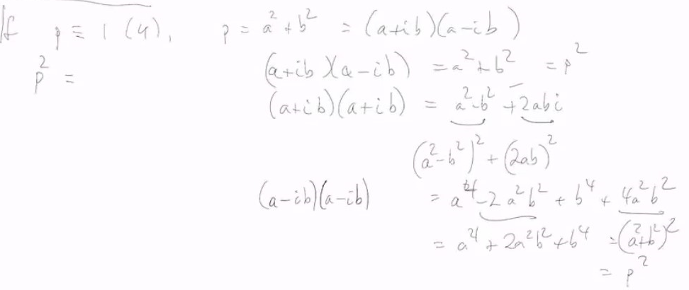
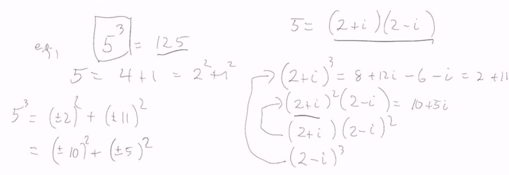
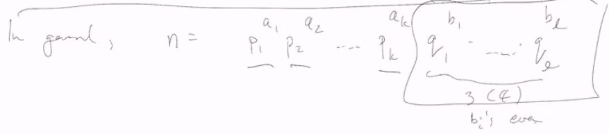
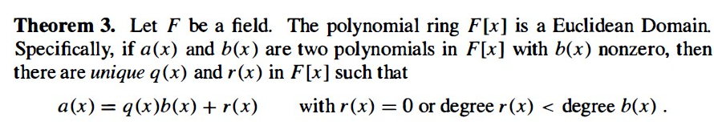
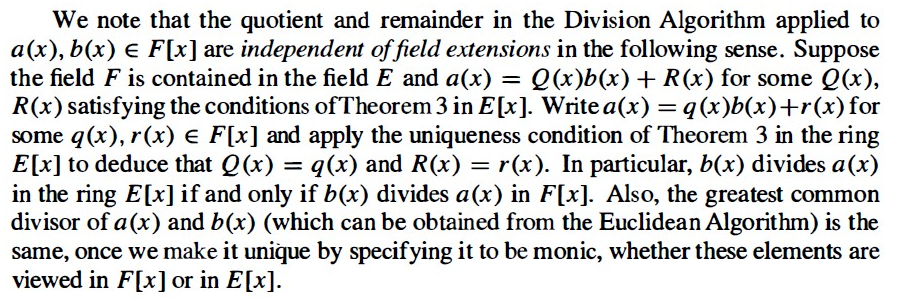

# Lec 30
## Theorem
* In $Z[i]$ the prime ideals are
  1. $(1 + i), (1-i)$
  2. $(p)$ for $p \equiv 3 \mod 4$
  3. $(a+ib), (a-ib)$ for $p \equiv 1 \mod 4, p = a^2 + b^2$

***
* What about $p^k$ as a sum of squares?
  * if $p \equiv 3 \mod 4$ and
    * and if $k = 2m$
       * then $p^k = (p^m)^2 + 0……2$
    * and if $k$ is odd, can't be done
  * if $p \equiv 1 \mod 4, p = a^2 + b^2 = (a+ib)(a-ib)$ 
    * 
  * for $p^3$, we have even more ways to write, example
  * 
    * thus power of primes, we can always find it as sum of squares as above way
* In general, $n = \pm p_1^{a_1}p_2^{a_2}...p_k^{q_k}q_1^{b_1}...q_l^{b_l}$
* 

# Polynomial Rings
### For this section, $R$ will always be polynomial ring with unit
### Definition
* $R[x] = \{a_nx^n + ... a_1x + a_0 : a_i \in R\}$ 
  * usually assume $a_n \neq 0$
  * We say $a_n$ as leading coefficient
    * $a_nx^n$ as leading term
  * If $a_n = 1$, we say $p(x)$ is monic
* Inside $R[x]$ we identify the constant polynomials with $R$

### Prop: 
* Suppose $R$ is an integral domain
  * if $p, q \in R[x]$ then $deg(p(x) q(x)) = deg(p) + deg(q)$
  * units in $R[x]$ are exactly the units in $R$
  * $R[x]$ is an integral domain
  * quotient field = rational function

### Prop
* If $I$ is an ideal in $R$, then $I[x] = (I)$ is an ideal
  * so basically ideal generated by $I$ is exactly those coefficient with $I$
1.  $R[x] / (I) \cong (R/I)[x]$ (doesn't need $R$ to be integral)
2. If $I$ is prime, then $(I)$ is prime in $R[x]$ 
   1. this is easy to prove as $R/I$ is integral and then $(R/I)[x]$ is integral so $R[x]/(I)$ is integral and thus $(I)$ is prime

### Definition: multiple variables
* $R[x_1,...,x_n] := R[x_1,..,x_{n-1}][x_{n}]$
* $x_1^{d_1}x_2^{d_2}...x_n^{d_n}$ is called monomial
  * thus an arbitrary element of $R[x_1,..,x_n]$ is  linear combination of monomials with coefficient from $R$
    * $d = d_1 + ... + d_n$ is the degree of a monomial
    * $deg(f) = max$(degree of monomials appear with non-zero coefficient) 

### Definition: Homogenous
* $f$ is homogenous of degree $k$ 
  * if all its monomials have degree $k$

e.g. $ax^2 + bxy + cy^2$ is (the only form of) homogenous of degree 2 in $F[x,y]$

* Any polynomial $f \in R[x_1,..,x_n]$ can be decomposed as $f = f_0+f_1 + ... + f_d$
  * where $f_i$ is homogenous of degree  $i$, $d = deg(f)$
  * and this decomposition is unique

### Theorem:
* If $F$ is a field then $F[x]$ is a Eculdiean domain
  * and norm is the degree
* But it turns out that $F[x,y]$ is a UFD but not $PID$ (as $(x,y) not principal$)
  * so not a Euclidean Domain

## Field Extension
* $F \subsetneq E$, both fields
  * and $f,b \in F[x]$,
    * $f = bq+r$ in $F[x]$
      * it will have same "decomposition" in $E[x]$
    * actually we are using the same norm (the degree)
* This is in P299 of the textbook,
  * actually we first have uniqueness of $b,r$ in one $F[x]$
  * and then we can talk about
  * 
  * 