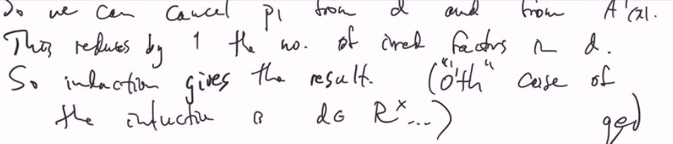
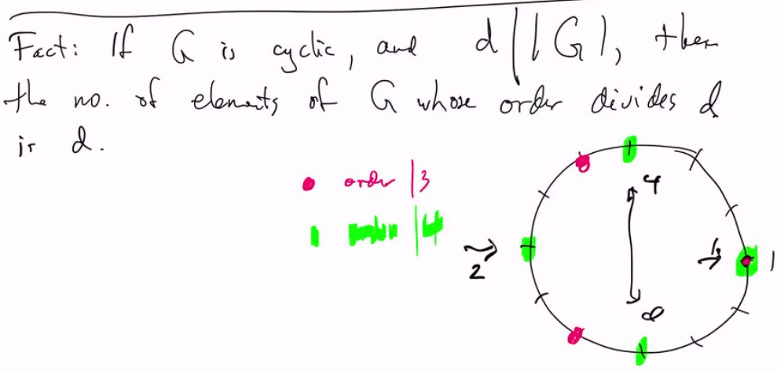

# Lec 31
### Theorem: 
* $R$ is a UFD then $R[x]$ is a UFD

Recall that polynomials of PID are not necessarily PID. ($Z[x]$ is not necessarily PID)
### Theorem: Gauss' Lemma (Pg.303)
* Suppose $R$ is a UFD, with quotient field $F$
* If $p(x) \in R[x]$ is reducible in $F[x]$
  * then it is reducible in $R[x]$

* Indeed if $p(x) = A(x) B(x)$ with $A, B \in F[x]$
  * then there is $r, s \in F$ s.t. $rA, sB \in R[x]$
  * and $p = rA \cdot sB$ 

***
* If $A, B \in F[x]$, so their coefficient are in $F$
  * so we can find a common denominator $d \in R$
  * so $dp(x) = A'(x) \cdot B'(x) \in R[x]$
* if $d \in R^\times$, $p(x) = d^{-1}A'(x) \cdot B'(x)$ done
* If $d \not \in R^\times$, use the UFD property to write
  * $d=p_1...p_k$, $p_i$ irreduciable (not necessarily distinct)
  * recall $dp(x) = A'(x) B'(x)$
  * mod $p_1$ on both sides (taking quotient again), let's write $\bar{d} = 0$ so
    * $0 = \bar{A'}(x) \bar{B'}(x)$
  * But $R/(p_1)$ is an integral domain
    * so either $\bar{A'}(x) = 0$ or $\bar{B'}(x) = 0$ (in $R/(p_1)[x]$) in $R/(p_1)[x]$
  * Suppose (WLOG) $\bar{A'}(x) = 0$,
    * so each coefficient of $A'(x)$ is divisible by $p_1$
    * this gives an induction argument
    * 
***
### Corollary: 
* $R$ is a UFD, quoteitn field $F$
  * Suppose $p(x) \in R[x]$ so that g.c.d. of its coeffieicnt is 1
  * Then $p(x)$ is irreducible in $R[x]$ iff it is ireducible in $F[x]$
* In particular, if $p(x)$ is monoic (the leading coefficient is 1)
  * then the same conclusion holds

### Theorem: 
*  $R$ is a UFD iff $R[x]$ is a UFD
* $\Leftarrow$ is trivial
* $\Rightarrow$ let $F =$ quotient field, $p \in R[x], d=gcd$(coefficient of p)
* $p = dp'$ so $p'$ has coefficient with gcd = 1
* This mean, in this proof we can WLOG assume $p$ always have gcd(coefficient) = 1
* $p(x)$ irreducible in $R[x]$ iff $p(x)$ irreducible in $F[x]$
* in $F[x]$ we can factor $p(x) = \prod_ip_i(x)$ $p_i$ irreducible, because $F[x]$ is a polynomial on a field, and thus ED thus UFD
  * $p(x) = \prod r_i p_i$ with $r_i \in F$, $r_ip_i \in R[x]$
  * gcd(coefficient of $r_ip_i$) = 1 for each $i$
  * Corollary => $r_ip_i$ is irreducble in $R[x]$
    * => $p$ factors as required
* Uniqueness : Easy but tedious -- in the book

***
### Criteria for irreducibility

### The Factor Theorem:
* A polynomial $f \in F[x]$ has a linear factor (a factor of degree 1) iff $f(x)$ has a root in $F$
  * trivial to prove using Euclidean Algorithm

### Corollary
* If $deg(f) = 2$ or $3$, then $f$ is irreducible iff
  * it has no root

### Prop: Rational Root Theorem (Prop. 11, Pg. 308)
* Consider $p(x) = a_nx^n + ... a_1x + a_0 \in Z[x]$
  * if $r/s \in \mathbb{Q}$ is a root in lowest term
    * then $r|a_0$, $s|a_n$ (i.e. $gcd(r,s) = 1$)
* In particular, if $p(x)$ is monoic, every rational root is actually in $Z$, and it must divide $a_0$

### Prop: (Prop 2 Pg.295)
* Suppose $R$ is an integral domain
* and $p(x) \in R[x]$ is monic, non-constant
  * suppose $0\neq I\neq R$ is non-trivial ideal
* if $\bar{p(x)} \in (R/I)[x]$ (reduce the coefficient of p mod I) is irreducible
  * then $p(x)$ is irreducible
* Proof is easy, contrapositive
***
* Converse of the above fails
  * $x^4 + 1$ is reducible module every $p$ but not reducible over $Z[x]$
### Theorem:
* In $F[x]$, the maximal ideals are just $(f(x))$ with f irreducible
* i.e. $F[x]/(f)$ is field iff $f$ is irreducible

### Theorem:
* Suppose we factor $g(x) \in F[x]$ as
  * $g(x) = f_1^{a_1} \cdot f_2^{a_2} ... f_i^{a_1=i}$ $f_i$ distinct irreducible
* then $F[x]/(g(x)) \cong F[x]/(f_1^{a_1}) \times ... F[x]/(f_k^{a_k})$

* Pf: Chinese Remainder Theorem! The irreducible distinct helps with comaximal
  
### Prop:
* If $f \in F[x]$ has roots $\alpha_1,...\alpha_n$
  * not necessarily distinct
* then $f$ has a factor of $(x-\alpha_1)...(x-\alpha_n)$
* the number of roots $\le$ degree

### Theorem: 
* Suppose $F$ is a field
* and $G \le F^\times$ is a finite subgroup of $F^\times$ (multiplicative group)
  * then $G$ is cyclic

* pf: Fundamental Theorem of abelian groups:
  * $G \cong (Z/n_1Z) \times ... (Z/n_kZ)$ with $n_1 | n_2 ... n_k$ 
    * Note: $Z/n_iZ$ is additive group, but $F^\times$ is multiplicative group
  * Fact: If $G$ is cyclic and $d| |G|$ then
    * the number of elements of $G$ whose order divides $d$ is $d$
    * 
  * So $Z/n_kZ$ has $n_k$ elements whose order divides $n_k$
  * But if $k>1$, $Z/n_1Z$ has $n_1$ elements of order dividing $n_1$ and $n_k$
  * so when $k>1$, $G$ has more than $n_k$ elements of order dividing $n_k$
  * so $x^{n_k} - 1$ has more than $n_k$ roots
    * but $deg(x^{n_k} - 1) = n_k$, a contradiction.

### Corollary
*  $(Z/pZ)^\times = \{1,2,3,4...p-1\}$ is cyclic under multiplication mod $p$

***
### Definition: Noetherian ring
* Suppose $R$ is commutative ring with unit
  * $R$ is called Noetherian if every ideal is finitely generated

### Theorem: Hilbert's Basis Theorem
* If $R$ is Noetherian, then so is $R[x]$ 
* Pf. 
  * $I \le R[x]$ an ideal
  * Let $L = \{\text{ all leading coefficient of elements of I}\}$
  * easy to see that $L$ is an ideal in $R$
  * So $L=(a_1,..,a_n)$ is finitely generated
    * suppose $f_i = a_ix^{n_i} + ...$
    * Let $d_i = deg(f_i)$, $N=\max \{d_i\}$
    * For $d < N$, let $L_d =\{0\} \cup \{\text{ leading coeff of all elements of I having degree } d\}$
      * easy to see $L_d$ is an ideal in $R$
      * so $L_d = (b_{d,1},b_{d,2},..,b_{d,n_d})$
      * with $f_{d,i} \in I$ has degree $d$ and leading coefficient $b_{d,i}$
  * Claim: $\{f_i\} \cup \{f_{d,i}\}$ generates $I$
    * for arbitrary polynomials, you can always reduce the degree of polynomials by induction and then any given polynomials you can write as a sum
  * Claim: tedious but not hard

### Corollary:
* $F[x_1,..,x_n]$ is Noetherian
* fields are noetherian because they only have two ideals