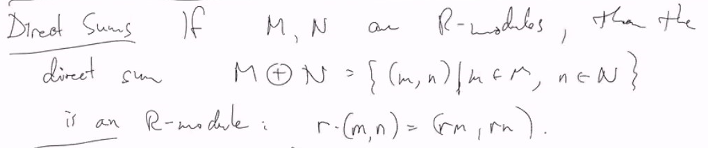
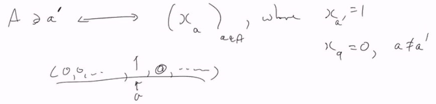
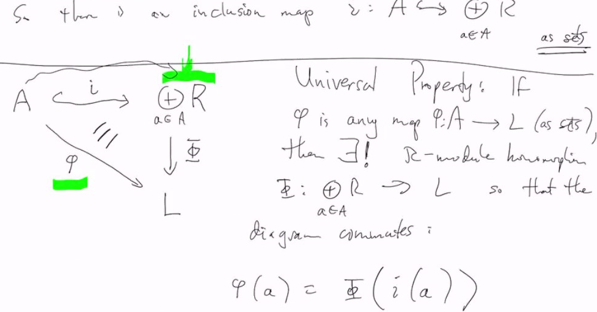
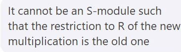

# Lec 33

# Coverage:
* Starting from UFD, and everything today covered

# Modules
* Abelian Group = Z-module
* Vector space = module on
* Vector space + linear Transformation = module polynomials ring

***
### Definition: Quotient Module
* if $R$ is a ring, $M \subseteq N$ submodule,
  * then $N/M$ makes sense as an abelian group
    * But there is an obvious multi's by $R$
    *  $r (n + M) = rn + M$
*  Easy to check: this turns $N/M$ into an $R$-module

### Defintion: $R$-module homomorphism
* If $M, N$ are $R$-Modules,
  * an $R$-Module homomorphism is a homomorphism $\phi:M \rightarrow N$ as an abelian groups
    * which also respects the multiplication by $R$
  * $\phi(rm) = r\phi(m)$
* $R$-isomorphism is obvious: bijection on the underlying set
* It is possible to have $R$-homomorphism between module on isomorphic ring
  * but unsure about on homomorphic ring

### Example:
* If $\phi : R \rightarrow S$ is a ring homomorphism
  * assume $\phi(1_R) = 1_S$
* then any $S$-Module $M$ become an $R$-module:
  * $r \cdot m :=\phi(r) \cdot m$
  * Easy to check conidtions for $R$-modules

***
* If $\phi: M \rightarrow N$ is an $R$-module homomorphism
  * then $ker(\phi) = \{m \in M : \phi(m) = 0\}$
  * it is easy to prove $R$-submodule of $M$

### Theorem: 4 Isomorphism theorems
1. If $\phi: M \rightarrow N$ is an $R$-module then
   1. $img(\phi) \cong M/ker(\phi)$ as $R$-module
2. Suppose $A, B$ are both $R$-submodule of an $R$-module $M$
   1. then $(A+B)/B \cong_R A/(A \cap B)$, 
      1. $A+B \subseteq M$ is just generated by $A,B$ as abelian group
3. If $A \supseteq_R B \supseteq_R C$ as submodules
   1. then $A/B \cong_R (A/C)/(B/C)$
4. Lattice Isomorphism Theorem:
   1. If $M \subseteq N$ is a $R$-submodule,
      1. then the lattice of submodules of $N/M$ is isomorphic to 
      2. the lattice of intermediate submodules $M \subseteq A \subset N$

*** 
### Definition: Generator
* $M$ is generated by $A$ means $M$ is the smallest module containing $A$ (inside $N$)
* If $M \subseteq_R N$, a subset $A \subseteq M$ is a set of generators of $M$
  * containing $A$
  * $M$ is the smallest submodule of $N$ containing $A$
  * Alternatively, $M = \bigcap_{A\le M' \le N} M'$ 

***
### Definition: Direct Sum $\oplus$

* Compatibe with the definition of direct sums of vector spces
* .....  with the definition of direct sums/products of abelian groups
* Can also define $M_1 \oplus ... M_r$ if each $M_i$ is an $R$-module
* Can even define (uncountably) infinite direct sums
  * If $M_i, i \in I$ are all $R$-modules then
    * $\bigoplus_{i\in I}M_i = \{(m_i) : m_i = 0, \text{ except for finitely many } i's\}$ 
      * an infinite tuple
  * It is different from infinite direct product: that is all entries are not restricted
    * countable infinite direct sum is countable
    * but countable infinite direct product is uncountable
    * it matters as they are different universal object
    * we will always deal with finite direct sum all the time
***
### Definition: A free Module is a direct sum
* $M = R \oplus R \oplus R ... \oplus R$
* $=\{ (r_1,r_2,...,r_n) : r_i \in R\}$
  * this $R$ is exactly the ring that $M$ is on

***
### Definition:
* Suppose $A$ is any set
  * the "free $R$-module on $A$"
  * $\bigoplus_{a \in A} R$ (one copy of $R$) $R$ has to have $1$ here
    * without $1$ in the following might causing the non-existence of the following universal property and the good inclusion (as counit)
  * It has a universal property. 
    * Suppose $L$ is an $R$-module and $\phi:A \rightarrow L$ is a map of sets
    * We can think of the set $A$ as a subset of $\bigoplus_{a \in A}R$ as follows 
    * 
* So there is an inclusion map $i : A \rightarrow \bigoplus_{a \in A}R$ as set inclusion
  * 
* Proof. $\phi(a) \in L$ has to be the image under $\Phi(i(a))$
  * But every element of $\bigoplus_{a \in A}R$ is a finite $R$-linear combination of elements of the form $i(a)$ some $a \in A$ so this determines $\Phi$.
    * $i$ is injective
    * consider $i(a) = (0,0,0...,1,0,0..)$ are each simple unit vectors in each basis
    * then $\Phi$ is determined everywhere because $\Phi$ is defined 
* this is the smallest $R$-module embedding $A$
* free modules on non-unital ring don't have this universal property because the good inclusion doesn't exist
* we need inverses actually in $R$?

***
# Test 4 coverage is those above
## Tensor Products
* Suppose $M$ is an $R$-module, and $R \subseteq S$ subring
  * can we extend $M$ to be an $S$-module?
* In general: No
* e.g. $R = \ints, S=\mathbb{Q}$, $M$ a finite abelian group
* Any $S$-module is a vector space over $Q$
  * But $M$ being finite, cannot be a vector space over Q
* In general cannot extend scalars
* 
* it will have a module containing it
### Definition: Tensor Products
