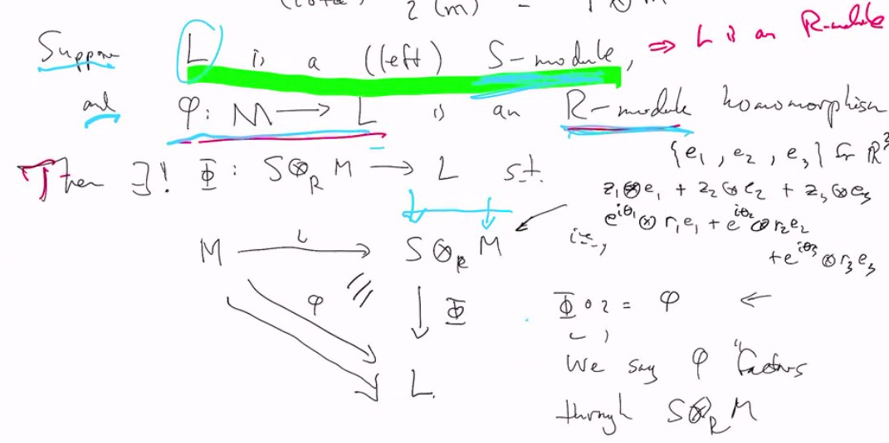

# Lec 34
### Module over a ring 
*  and extend it into a module on a bigger ring
  
### Example:
* $R = Z$, consider the $Z$-module $Z/pZ$ (an additive group)
* can it be extended to be a $Q$-module 
  * (i.e. a vector space over Q)
  * the answer is no because non-trivial $Q$-vector space is always infinite; but this Z-module is finite

***
* We address this problem by asking how much we can extend the scalars, rather than "can we extend them completely".
***
* We start with an $R$-module $M$ and a ring $S$ that contains $R$
  * and we construct the free-module on $S \times M$, regarded as an abelian group
  * We will take a quotient 
* Let $N$ be the subgroup generated by the following elements
  * $((s + s') ,m) - (s,m) - (s',m)$
  * $(s,m + m') - (s,m) - (s, m')$
  * $(sr, m) - (s, rm)$ 
    * with arbitrary $s,s' \in s, r \in R, m,m' \in M$

### Definition: Tensor Product
* Then define $S \otimes M = S \otimes_R M = S \times M / N$
  *  a typical element of $S \otimes M$ is $s \otimes m + N$ 
     *  or even $(\sum s_i \otimes m_i) + N$
*  when we write $s \otimes m$ it means a whole coset
*  and $sr \otimes m = s \otimes rm$

### Theorem:
* We can make $S \otimes_R M$ into an $S$-module by 
  * $s \cdot (s' \otimes m) = ss' \otimes m$
  * easy to check this works and makes $S \otimes_R M$ into an $S$-module

### Example:
* $Q \otimes_Z Z/pZ$
  * observe that, writing $\overline{m}$ for $m+pz \in Z/pZ$
  * $1 \otimes \overline{m} = \frac{1}{p} \otimes_Z \overline{m} = \frac{1}{p} \otimes p\overline{m} = \frac{1}{p} \otimes 0 0 = \frac{1}{p} \cdot 0 \otimes 0 = 0 \otimes 0$
* An analogous calculation shows that $\forall r \in Q, \overline{m} \in Z/pZ, r \otimes \overline{m} = 0$
  * i.e. $Q \otimes_Z Z/pZ = \{0\}$

***
### Theorem: Universal Property for Tensor Products
*  As above, $M$ an $R$-module, $R \subseteq S$
   *  construct $S \otimes_R M$ an $S$-module
*  Suppose $\iota : M \rightarrow S \otimes_R M := m \mapsto 1 \otimes m$,
*  Suppose $L$ is a left $S$-module, (thus an $R$-module)
   *  and $\phi : M \rightarrow L$ is an $R$-module homomorphism
*  Then there exists a unique $\Phi : S \otimes_R M \rightarrow L$ s.t.
   *  
   *  

***
* We can even take tensor product of two modules $M \otimes_R M'$