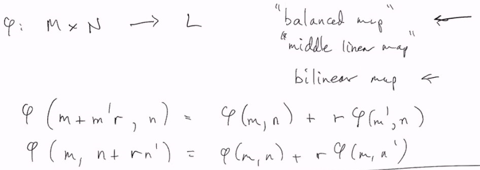
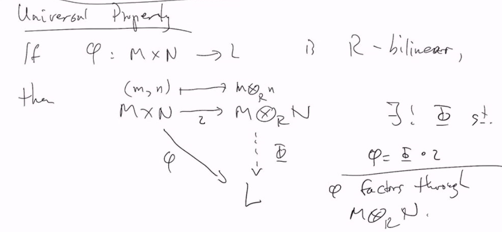

# Lec 35
### $R$-module homomorphism $\phi: M \rightarrow N$
* The set of all $R$-homomorphism $M \rightarrow N$
  * is $Hom_R(M, N)$
  * sometimes $Hom(M,N)$, but ambiguous
### Homomorphism into abelian group
* Adding homomorphism turns $Hom_R(M, N)$ into an abelian group:
  * $(\phi + \psi)(m) = \phi(m) + \psi(m)$
* and $Hom_R(M,N)$ also has the structure of an $R$-module 
  * $(r \cdot \phi)(m) = r \cdot \phi(m)$
    * left: action on $Hom_R(M,N)$
    * right: action on $N$
***
### Definition: The Endomorphism ring of $M$
* If $\phi \in Hom_R(M, N), \psi \in Hom_R(N, L)$
  * $M, N, L$ all $R$-modules
  * then $\phi \circ \psi \in Hom_R(M,L)$
* This $\circ$ turns $Hom_R(M, M)$ into a structure of a ring
  * (by composition)
  * the endomorphism ring of $M$
***
### Definition: Tensor Product, 2nd time
* Assume $N$ is a left $R$-module, 
  * $M$ is a right $R$-module
* We construct $M \otimes_R N$
  * and we have $mr \otimes n = m \otimes rn$ for $r \in R$
* as the quotient of free modules on $M \times N$ by the submodule generated by
  * $(m+m') \otimes_R n - m\otimes_R n - m' \otimes_R n$
  * $m\otimes (n+n') - m\otimes n - m \otimes n'$
  * $mr\otimes n - m \otimes rn$
* Universal Property!
  * $M \otimes_R N$ has a universal property as follows
  * balanced map
  * middle linear map
  * bilinear map , when $R$ is commutative
    * 
  * 
    * the universal property still holds for $R$-balanced (i.e. $R$ is not commutative)
***
### Example
* $R = Z, M = Z/2Z, N = Z/3Z$
  *  
  * you can see here that $Z \times Z, (0,1) \neq (0,0)$; $Z \otimes Z, 0\otimes 1 = 0 \otimes 0$
    * note that the element $a \otimes b$ is actually the (representative of) the coset
***
### Definition: multilinear maps 
* $M_1 \times ... M_n$ <- multilinear maps
* $M_1 \otimes_R ... \otimes_R M_n$ <- analogous universal property
  * $R$ has to be commutative

### Theorem: Associativity
* $(M \otimes_R) \otimes_R L \cong M \otimes_R (N \otimes L)$
  * analogous for multi-linear case
  * here $R$ is still commutative

#### Homological Algebra, but boring and skip it (???)
## Chapter 11: Vector Space + Linear Algebra as modules!