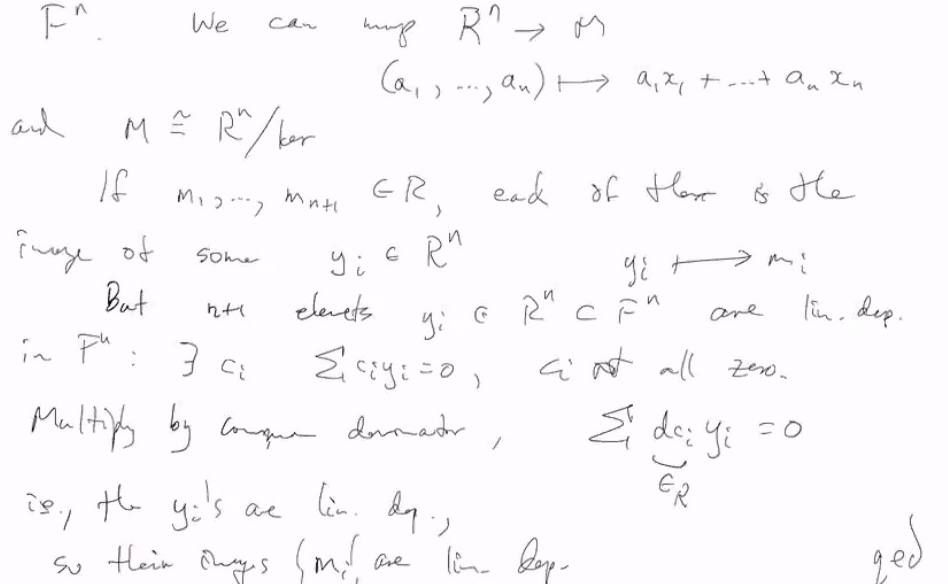
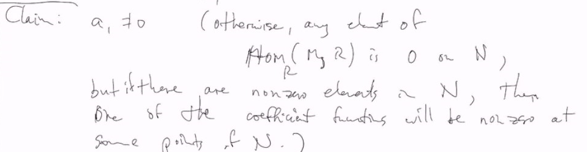
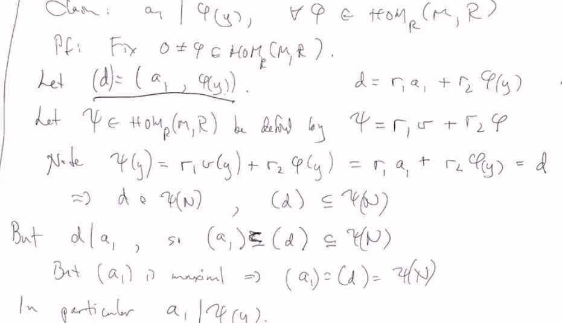
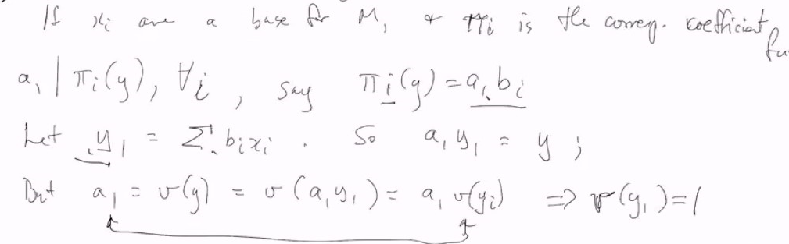
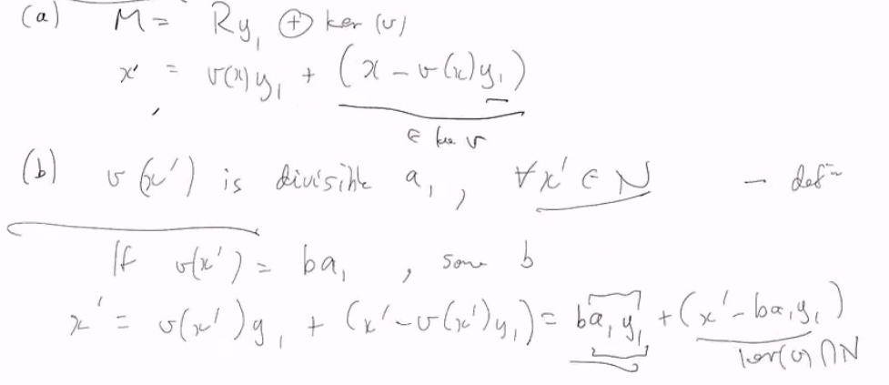

# Lec 36
* You can consider cyclic group as Z-modules 

### Definition: Ascending Chain 
* If $R$ is a ring, an "ascending chain" of $R$-modules is a sequence 
  * $(... \subsetneq ) M_1 \subsetneq M_2 ....$

### Definition: 
* An $R$-module $M$ is Noetherian if
  * if has no infinite ascending chain of $R$-submodules
* (i.e. any ascending chain of $R$-submodules "stabilizes" eventually)
* the ACC condition (ascending chain condition)

### Definition:
* A ring is Noetherian if it is Noetherian as a module over itself
***
* e.g. $R = Z$ is Noetherian: submodules are ideals
  *  $(a_1) \subsetneq (a_2) \subsetneq (a_3) ...$
  *  means $... | a_3 | a_2 | a_1$
*  Note that $Z$ doesn't satisfy the DCC (descending CC)
   *  $(2) \supseteq (4) \supseteq (8) ...$

* Thanks to Emmy Noether

### Recall: The THeorem
* A ring is noetherian iff every ideal of it is finitely generated

### Theorem: T.F.A.E
* R commutative ring with unit,
* $M$ an $R$-module
* the following three are equivalent to each other
* are the three properties
  1. $M$ is Noetherian
  2. Any non-empty family $\Sigma$ of submodules of $M$ has a maximal element
     1. YES they might not consist of into a set (because of some fundamental problems)
        1. but no worry in this course
  3. Every $R$-submodule of $M$ is finitely generated

Pf.
1. $1 \Rightarrow 2$ let $\Sigm$ be a non-empty family of $R$-submodule of $M$
   1. Pick $M_1 \in \Sigma_1$ 
      1. if $M_1$ is maximal, we are done
      2. otherwise can find $M_1 \subsetneq M_2$ 
         1. if $M_2$ is maximal then we are done
         2. otherwise we can continue
         3. if this process never terminates, it contradicts 1
            1. So it terminates, proving 2 
2. $2 \Rightarrow 3$ If $N = \{0\}$, then we are done
   1. otherwise, assume $N \neq \{0\}$
      1. Pick $0 \neq x_1 \in N$, if $N = (x_1)$ -done
         1. otherwise pick $x_2 \in N \backslash (x_1)$, if $N = (x1, x_2)$ we are done again
      2. Let $\Sigma = \{(x_1) \subsetneq (x_1,x_2), \subsetneq (x_1,x_2, x_3) ....\}$
         1. then we can find a maximal element
3. $3 \Rightarrow 1$ Suppose $N_1 \subsetneq N_2 ....$ is an asc chain of $R$-modules, let $N = \bigcup_i N_i$, which is an $R$-submodule of $M$
   1. By (3) $N=(x_1,..,x_n)$ Since the $N_i$'s are increasing,and each $x_i$ is in some $N_i$ (and hence in all $N_k$'s $k \ge j$)
   2. there is some $m$ s.t. $x_1,..,x_n \in N_m$, i.e. $N=N_m$,
      1. i.e. the chain terminates
### Cor: Any PID R is Noetherian
* Pf. from the property (3)

***
### Definition: rank of module
* Say $M = (x_1,..,x_n)$
* rank is just the smallest $n$ satisfying above

* Note that there are things finitely generated but submodules not finitely generated
  * and there are even things finitely generated not Noetherian
### Prop: Page 459
* Suppose $R$ is an integral domain and $M$ is a finitely generated module of rank $n < \infty$
* there are $n+1$ elements of $M$ are linearly dependent over $R$

* Pf.
* Say $M$ is finitely generated by $\{x_1,..,x_n\}$ (because it is rank n) 
* Let $F$ be the quotient field and note that $R^n$ can be regarded as embedded in the $F$-vector space $F^n$ 
  * We can map $R^n \rightarrow M$
    * $(a_1,..,a_n) \mapsto \sum_i a_i x_i$
  * and $M \cong R^n/ker$
  * if $m_1,..,m_{n+1} \in M$, each of them is the image of some $y_i \in R^n \subseteq F^n$ are linearly dependnet in $F^n$: $\exists c_i, \sum_i c_i y_i = 0$ , $c_i$ not all zero
  * 

***
### Definition: Torsion and Annihilator
* If $M$ is an $R$-module, $Tor(M)= \{m | rm = 0 \text{ for some } 0 \neq r \in R \}$
* $Ann(M) = \{r \in R : rm = 0, \forall m \in M\}$

### Theorem (~P.460)
* Suppose $R$ is a PID and $M$ is a finitely free $R$-module 
  * say of rank $n < \infty$
* Suppose $N \subseteq M$ is an $R$-submodule, then
    * $N$ is a free $R$-module of rank $n \le m$
    * there is a base $x_1,..,x_m$ of $M$ and $a_1,..,a_n \in R$
      * s.t. $\{a_ix_i\}_i$ is a base of $N$
        * Moreover $a_1 | a_2 | ... | a_n$

Pf.
* Consider $Hom_R(M, R)$ homomorphism $M \rightarrow R$
  * Let $\Sigma = \{\phi(N) = (a_\phi) : \phi \in Hom_R(M, R)\}$
  * Because $R$ Noetherian, there is a maximal element $v(N)$ with $v \in Hom(M, R)$
    * $v(N) = (a_1)$
    * Claim: $a_1 \neq 0$ (otherwise any element $Hom_R(M, R)$ is 0 on $N$
      * but if there are non-zero elements in $N$ )
      * 
      * coefficient function is just projection function
  * Since $a_1 = v(y)$ for some $y \in N$
  * Claim: $a_1 \| \phi(y)$ for all $\phi \in Hom_R(M,R)$
    * Pf. Fix $0 \neq \phi \in Hom_R(M,R)$
      * Let $(d) = (a_1, \phi(y))$ $d = r_1a_1 + r_2\phi(y)$
      * Let $\psi \in Hom_R(M,R)$ be defined by 
        * 
      * thus $(a_1) = (d_1) = (a_1, \phi(y))$, thus $a_1 | \phi(y)$
  * If $x_i$ are a absis for $M$
    * 
      * $v(x - v(x)y_1) = v(x) - v(x)v(y_1) = 0$ since $v(y_1) = 0$ thus we have this in kernel
    * 
  * rank($ker(v) \cap N$) = n-1, 
    * then we can use induction on $n = rank(N)$ (trivial if $n=0 \Rightarrow N=0$)

***
* Still haven't talked about uniqueness
### Theorem: Fundamental Theorem of Module

### Theorem: Fundamental Theorem of Abelian Group