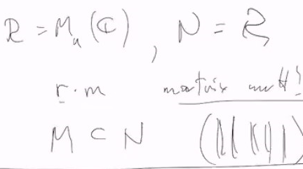
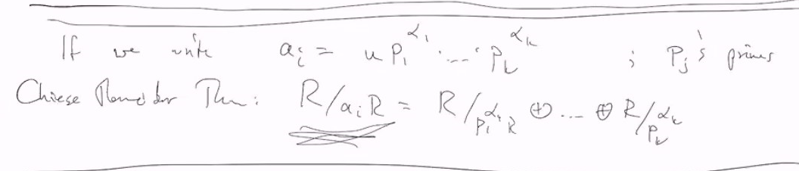

# Lec 37
Q2 in PS14:

***
### Vector spaces
* subspace $W \subseteq V$
### Theorem: Can find a basis 
* $\{e_1,..,e_n\}$ of $V$
  * s.t. $\{e_1,..,e_m\}$ are a basis of $W$
* $R^n$, $\{e_1,..,e_n\}$ base for $V$
  * s.t. $a_1e_1,a_2e_2, ..., a_m e_m$ is a base for $W$
* $Z \supseteq nZ$
* $v \in Hom_R(M, R) \leftrightarrow$ dual space
* Chapter 12
* totally don't know what he is talking abut
* suggesting going through the 5 minutes that you are lost, it is March 18th.
* Theorem 4 page 460.
***
### Theorem: 5 page 462
* Suppose $R$ is a PID and $M$ is a finitely generated $R$-module
  * $M \cong R/(a_1R) \oplus R/(a_2R)$
* In particular,
  * $G \cong Z/(a_1Z) \oplus ... Z/(a_nZ)$
  * this is just the fundamental theorem of abelian group
* Sketch of the proof:
  * If $M$ is generated over $R$ by $\{m_i\}$
    * define an $R$-module homomorphism, $\phi: R^n \rightarrow M$
    * $\phi : e_i \mapsto m_i$
    * then by First Isomorphism Theorem, $M \cong R^n / ker(\phi)$
    * Apply the previous theorem to $ker(\phi) \subseteq M$
      * to find a basis $x_1,..,x_n$ of $M$
      * and $a_1 | a_2 | ...$ s.t.
        * $ker(\phi) = \langle a_1x_1,..,a_nx_n \rangle$
          * so $R^n/ker(\phi)$

***
* The $a_i$'s are called the invaraint factors
  * Note $a_i \in R$
* If $m$ of the direct summands are $R$ (i.e. $m$ of the $a_i$'s are 0), then $M$ contains a copy of $R^m$,
  * and $m$ is the Betti number of $M$ (rank of free part)
***
* If we write $a_i = up_1^{a_1}...p_ma^m$
  * $p_j$'s primes Chinese Reminader Theorem:
  * 
***
* The various $p_j^{a_j}$ occuring in all the $R/a_iR$'s are called the "elementary divisors" of $M$
***
* The invariant factors and the elementary divisors are uniquely determined by $M$
  * $M \cong_R M'$ iff they have the same {invariant factor, elemenary divisors}
* Elementary divisor decomposition
### Example:
* $R = \mathbb{R}[x]$
  * $R/(x^2+1)$ is already elementary divisor decomposition
* $R/x(x^2)$
* 
### Example
* An $F[x]$-module amounts to a $F$-vectorspace $V$ and a linear transformation $T$, 
  * s.t. $x \cdot v = T(v)$
* will get the Jordan Canonical Form and 
  * Rational Canonical Form
***
* Basically module over PID have simple structure related to the quotient ring
  * and we go through fundamental theorem of abelian group somehow
  * and it is useful to deduce Canonical Form result like above