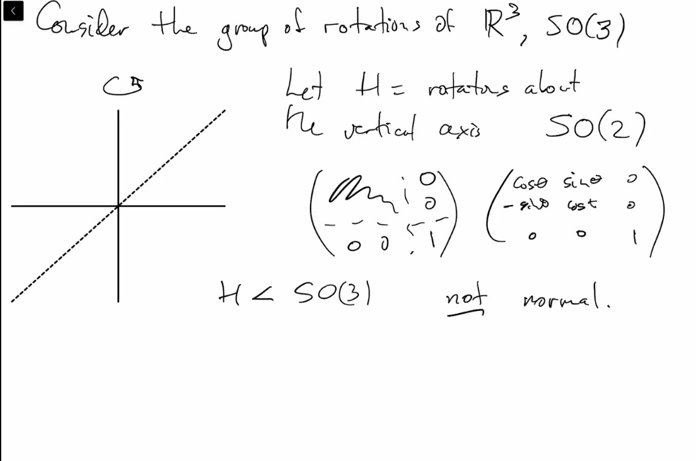
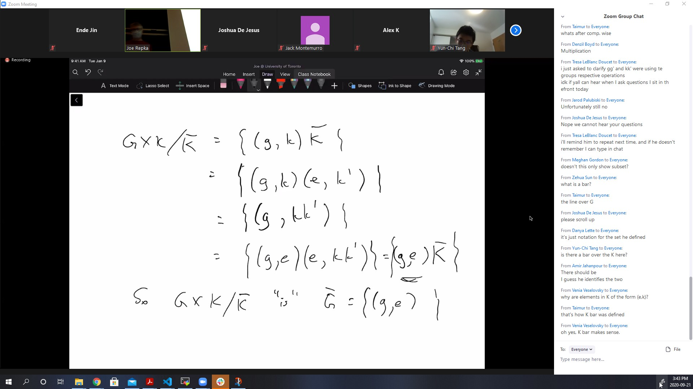
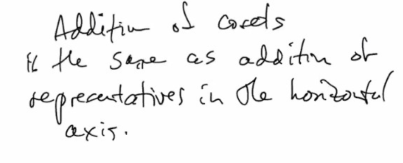
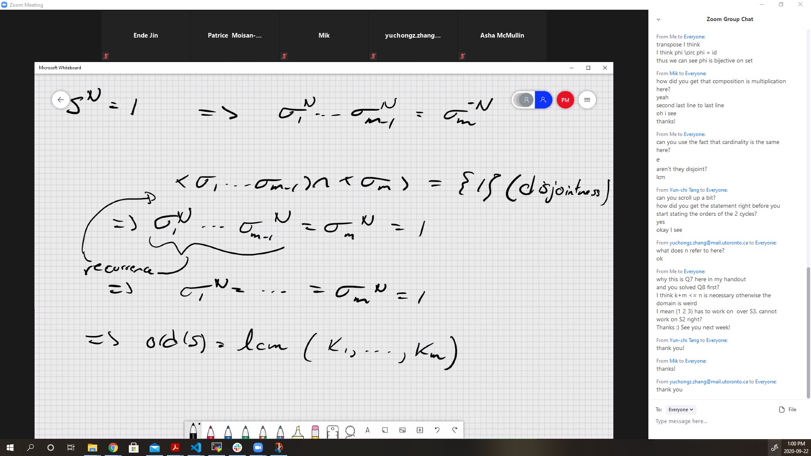

# Lec 4
### Coset!
*  $H$ is norrmal if 
   *  $\forall x \in G, \exists y, xH = Hy$
   *  But $x \in xH$ then $x \in Hx$, thus it has to be $Hx$
   *  i.e. $xH = Hx$ 
   *  i.e. $xHx^{-1} = H$
   *  $H <| G \iff \forall x, xHx^{-1} = H$

***
* Consider the group of ratations of $\reals^3$, $SO(3)$
  *  every rotation is described by an orthogonal 3×3 matrix (i.e. a 3×3 matrix with real entries which, when multiplied by its transpose, results in the identity matrix) with determinant 1
  *  
  *  Now consider $G / H = SO(3) / SO(2)$, which is not a group, just a coset space
  *  Suppose $\Omega$ takes $N$ to a fixed $P$
  *  then $\Omega H = \Omega SO(2)$ all takes $N$ to the $P$
  *  Given any $P$ on the unit sphere, $S$, can rotate $N$ to $P$ .
     *  i.e. $\exists \Omega \in SO(3), .s.t. \Omega N =P$, thus $SO(3) / SO(2) \cong S$, which is the unit sphere
  *  go though this bijection yourselves!

### Definition: direct product
* If $G, K$ are groups
  * denote $G \times K := \{(g,k) : g \in G, k \in K\}$
  * $(g,k) \cdot (g', k') = (g \cdot g', k \cdot k')$
  * identity is of course $(e_G, e_K)$
***
* $(\Reals^2, +) = (\reals, +) \times (\reals, +)$

***
* In $G \times K$, have subgroups $\bar{G} = G \times \{e_K\}, \bar{K} := \{e\} \times K$
  * They are normal! 
  * $(g,k) \bar{G} (g^{-1}, k^{-1}) =\{(g g' g^{-1}, e)\} \subseteq \bar{G}$
    * the other subseteq is trivial
  * $G \times K / \bar{K}$
  * 
  * geometrically speaking
    * in $\Reals^2, \reals$ coset are $(k, 0)$ + vertical axis = vertical lines
    * 

### Definition: homomorphism
* A map $\phi : G \rightarrow K$ ia a homomorphism
  * iff $\phi(g \cdot_G g') = \phi(g) \cdot_K \phi(g')$
* if in addition $\phi$ is a bijection (1-1 and onto)
  * then $\phi$ is isomorphism
  * if we define $\phi : G \times K \rightarrow G$, by $\phi := (g,k) \mapsto g$
    * it sometimes called projection of $G \times K$ onto $G$
  * isomorphism is basically what equality means

### Definition: Symmetric Group
* $n \in \natnums, S_n =$ symmetric group of order$n$
  * = set of permutation of $n$ symbols usually $(1, ..., n)$
  * interestingly $S_3 =$ exactly those reflections and rotations
* it is easy to see that $|S_n| = n!$
* Notation: if we write $(a, b, c)$ with $a,b,c \in \natnums$
  * this is a "cycle", the permutation (the function) that takes $a \mapsto b, b \mapsto c, c \mapsto a$
  * $(a_1,..,a_k)$ is a $k$-cycle
    * interestingly, this is also a cyclic group of order $k$
      * (1 2 3 4) and (1 2 4 3) both generate 4 elements
      * (3 4) is a 2-cycle
    * $a_i \mapsto a_{i+1}, a_k \mapsto a_1$
    * (a,b) two cycle = transportation
    * (1 2 3)(3 4) = (1 2 3 4)
    * (3 4)(1 2 3) = (1 2 3 4)
    * not disjoint, don't expect commute
    * Any permutation can be written as a product of dijoint cycles (unqiue except for rotational and order of disjoint cycles)
    * (1 2 3) = (3 2 1)
    * not unique for non-disjoint cycles
    * same permutation can be written in more than 1 way
    * a $k$-cycle has order $k$
  
### Definition: 
* if $\phi : G \rightarrow K$ is a homomorphism
  * then \{g : G : \phi(g) = e\} is called kernel of $\phi$, $ker(\phi)$
* Easy: $ker(\phi) < G$, after all $e \in ker(\phi)$
* in linear algebra, a linear transformation $\phi : V \rightarrow W$, groups with addition, has $ker(\phi) = nullspace(\phi)$
* Also $image(\phi) = \{\phi(g) : g \in G\} = cokernel(\phi)$ also a subgroup, but of $K$
* In fact, $ker(\phi)$ is a normal subgroup
***
* $ker((g,k) \mapsto g) = \bar{K}$
* $\phi : \{e\} \times K \rightarrow K$ is an isomorphism
* thus $ker(proj) \cong K$
  * on $\reals^2$, kernel of projection to $x$-axis is $y$ -axis
* $(Z < \reals)$, normal subgroup due to abelion
  * what is $\real / Z$ ? all the number with same number after point in decimal
    * every coset has exactly one element in $[0, 1)$
      * it is actually a bit misleading, acutally it corresponds to the closed circle
      * $\reals / Z \cong circle$
    * $\phi : t \mapsto e^{2\pi i t} := \reals \rightarrow $ circle
      * $ker(\phi) = Z$, thus $e^{2\pi i t} = e^{2 \pi i (t + n)}$ for $n \in Z$
      * $Z^2 <| \reals^2$
      * $\reals^2 / Z^2 \cong torus \cong circle \times circle$

