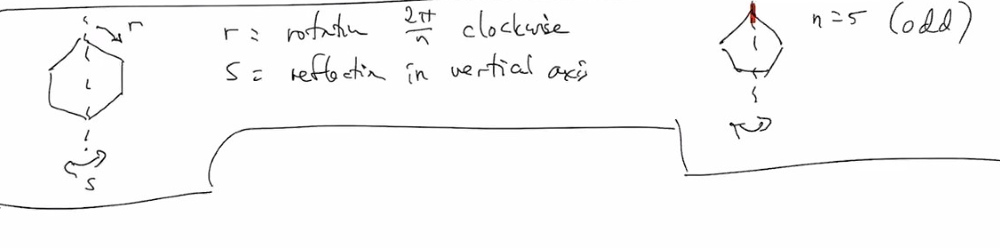
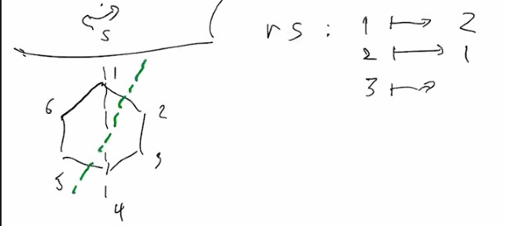

# Lec 5
### Announcement

***

### Definition: Dihedral Group
*  Regular $n$-gon
*  we have $D_{2n} =$group of rotations and reflections that on $n$-gon
*  $|D_{2n}| = 2n$ (some people call it $D_n$)
*  
*  For $D_{12}$, $rs: 1 \mapsto 2, 2 \mapsto 1, 3 \mapsto 6, 4 \mapsto 5, 5 \mapsto 4, 6 \mapsto 3$, 
   *  
*  $n$ rotations
*  $n$ reflections
   *  whether $n$ is even or odd
   *  not 2n reflections -- you are counting repeatedly
***
* for equilateral triangle, rotations like $(123),(132)$; reflections like $(12),(13),(23)$
  * in fact that $S_3 \cong D_6 \cong$ group of the triangles
    * group of triangle is just $D_6$
  * $\phi : e\mapsto e$
    * $(123) \mapsto r$
    * $(132) \mapsto r^{-1}$
    * $(23) \mapsto s$
    * $(12) \mapsto rs$
    * $(13) \mapsto r^2s$
  * $rs : 1 \mapsto 2$
    * $2 \mapsto 1$
  * $sr = (13)$
  * $sr^{-1} = (12)$
  * $rs = sr^{-1}$ holds in $D_{2n}$ for arbitrary $n$
  * $\langle s,r | s^2 = e = r^3, rs = sr^{-1} \rangle \cong D_6$
    * left part is generator
    * right part is reltionas
  * $\langle s,r | s^2 = e = r^n, rs = sr^{-1} \rangle \cong D_{2n}$
    * writing a group by generators and relations
    * a "presentation of the group"
    * a group has many presentations
    * hard to predict the structure of the group (even whether it is finite) 
### Definition: automorphism
* An isomorphism from a group to itself is an automorphism
  * in particular it is bijective
* If $x \in G$, them map $c_x := g \mapsto x g x^{-1}$ is an automorphism
  * since $c_x(gh) = xghx^{-1} = xgx^{-1}xhx^{-1} = c_x(g) c_x(h)$
  * the inverse is of course $(c_x)^{-1} = c_{x^{-1}}$
* Automorphisms of this type are called "inner automorphisms"
  * some groups have automorphism because of other structure
### Definition: Conjugate
* Taking $g$ to $xgx^{-1}$ is called conjugating $g$ by $x$
  * $xgx^{-1}$ is a conjugate of $g$ by $x$
  * when $c_x = id$? 
    * a simple answer is $e$
    * but abelion group it always holds

### Definition :
* The set of all $x$ satisfying $xg = gx$ forall $g \in G$
  * is called the center of $G$, denoted $Z(G)$
    * $e \in Z(G) \subseteq G$
    * Easy to see $Z(G)$ is a subgroup
* If we fix $x \in G$, $\{g \in G : gx = xg\} = Z_G(x) =$ the cerntralize of $x$ in $G$

***
* $(123) \in S4$
  * $(345)(123)(345)^{-1}$
  * $=(345)(123)(354)= (124)(3)(5)$
  * Conjugate in $S_n$ is "relabelling"