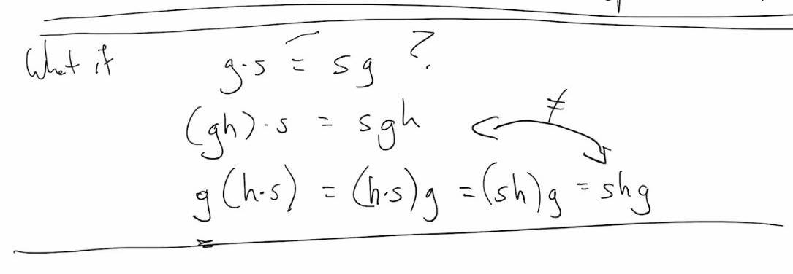
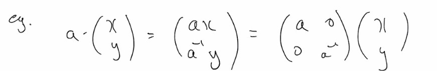

# Lec 6

### Definition: Group Actions
* A group $G$ acts on a set $S$ if 
  * there exists a map $G \times S \rightarrow S$ s.t. 
    * $(g, s) \mapsto gs$
* subject to 
  * $(gh)s = g (hs)$ for all $g,h \in G$ and $s \in S$
  * $es = s$
    * first one looks like homomoprhism

***
* $SO(3) = G, S =$ any 3 dimensional object
  * a rotation $\Omega$ acts on $S$ by rotating each point
* if we write $S$ as a set of column vectors
  * then $\Omega S$ is matrix multiplication 
    * $\Omega S$ is matrix multiplication  --> this sentence means omega (itsself as a matrix) matrix multiplies each s in S to get the result?
***
* You have to take $G$ to be a suitable subgroup of $SO(3)$: elements that preserve $S$
* similarly subgroups of $SO(2)$ acting an shape in $\reals^2$ e.g. 6-gon rotation of a regular n-gon
* SO(3) acts on the unit sphere $S^2$

***
### Terminology: 
* Consider $SO(3)$ acting on $S^2$
  * $SO(3) \cdot N = S^2$
* if $SO(2)$ is rotations about the axis through the poles
  * then $SO(2) \cdot N = \{N\}$
* If $P$ is a equator, $SO(2) \cdot P = P$
* if $P * N \not \in equator, SO(2) P =$ lines of latitude

### Defintion: Orbit
* If $G$ acts on $S$ and 
  * $G\cdot S$ is the orbit of $S$ around 

***
### Definition: right action
* $G \times S \rightarrow S$
  * $(g, s) \mapsto s \cdot g^{-1}$ 
    * this definition is because if defined otherwise
      * 

***
* Remember on sphere $SO(2) \cdot N = \{N\}$, $SO(2)$ fixes $N$

### Definition: stability roup of $s$
* those $s \in S$ s.t. $\{g \in G : g \cdot s = s\}$

### Proposition: 
* if $H =$ stability group of $s \in S$
  * then the orbit $G \cdot s$ "is" the set of cosets $g \cdot H$
* i.e. 
* $g, g'$ goes to the same point in the orbit iff $g H = g' H$ (coset)
* $G \rightarrow S := g \maptso g \cdot s$

### Example
* $G = (\reals^{>0}, \times)$
  * $G$ acts on $\reals^2$ in the obvious way by expanding and shrinking about 0
* $G$ has other actions
  * e.g. $a \cdot (x , y) = (ax, a^{-1}y)$
  * 

***
* If $G$ is a roup then $G$ acts on $G$ by $L: (g,h) \mapsto gh$
  * or $R: (g, h) \mapsto h g^{-1}$
  * Observe $L, R$ commute:
    * if we write $L_g : G \rightarrow G := h \mapsto gh, R_g : G \rightarrow G:= h \mapsto hg^{-1}$
    * then $L_g \circ R_g = R_g \circ L_g : x \mapsto gxg^{-1}$
    * $L_g \circ R_k = R_k \circ L_g: x \mapsto g x k^{-1}$
    * Note that $L_g \circ R_g = R_g \circ L_g = C_g$ conjugate
  * $C$ is a left action
    * $C: (g,h) \mapsto ghg^{-1}$
      * or a right action
        * if $(g, h) \mapsto g^{-1}hg$
  * the orbits under $C$ of $x$ are things like $\{gxg^{-1} : g \in G\}$
    * the conjugacy class of $x$
      * what is the stabilizer of $x$ for $C$?
        * $Z_G(x)$
    * if a group $G$ acts on a set $X$, if $x \in X$ 
      * then stabilizer of G on x, $G_x = \{g \in G: gx = x\} \le G$
***
* In $S_n$ what are the conjugacy classes?
  * e.g. is $(123)$ conjugate to $(234)$ in $S_4$?
    * $(1234)(123)(1234)^{-1}$
  * is $(123)$ conjugate to $(4567)$ in $S_7$ -- impossible, they have different order
  * $(123)(12)(12) = (123)$
  * different "cycle types", same elements
* Idea: if we take $\sigma \in S_n$ and
  * write it our a product of disjoint cycles
    * then the cycle type determines the conjugayc class and vice versa
    * e.g. $S_3 : \{e\}, \{(ab)\}, \{(abc)\}$ 3 conjugacy classes
    * $S_4: \{e\}, \{(ab)\}, \{(abc)\} , \{(abcd)\}, \{(ab)(cd)\}$
* (123)(246)(35) = product of 2 cycles?
  * = (15)(13)(16)(14)(12)
    * non-disjoint
### Theorem: 
* $S_n = <(ab) | 1 \le a < b \le n>$

***
* Another example
  * (256)(145)(53)
  * = ??(14)
  * = ?? (16)(14) (as 4 goes to 6)
  * = ?? (12)(16)(14) (as 6 goes to 2)
  * ....
  * = (13)(15)(12)(16)(14)
* (12)(24)(56)(56) = (12)(24)
  * the number of transposition need is not well-defined

### Fact: 
* The parity (even or odd) of the number of transpositions need to express $r \in S_n$ is well-defined.
  * we say that $r$ is even or odd accordingly
***
* (12) odd
* (123) = (13)(12) even
  * actually (123...2k) odd
    * (123...(2k+1)) even