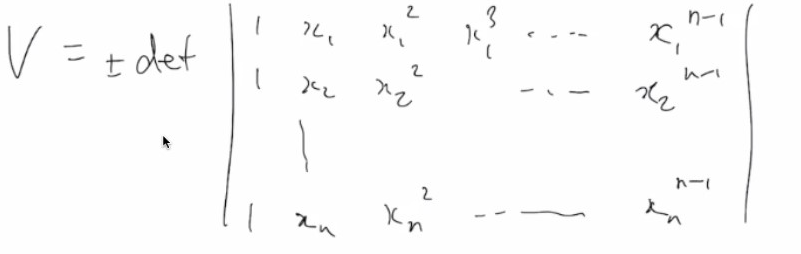
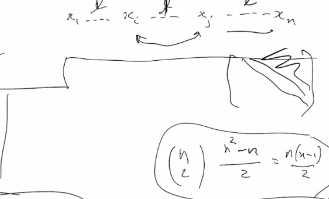

# Lec 7

### Theorem: Parity preserves
* In $S_n$, if you write $r \in S_n$
  * as a product of transpositions, 
    * the parity (even/odd) of the number of transpositions needed to express $r$
    * remains the same
* (12)(34)(34) = (12) 
***
* Consider polynomial is $n$ variables, $x_1,..,x_n$ and the polynormial $V = \pi_{1 \le i < j \le n>} (x_i - x_j)$
  * van der monde polynomial
### Fact:
* 
***
* if $\sigma \in S_n$, we can let it permute $x_1,..,x_n$ s.t. taking $x_i$ to $x_\sigma{i}$
* $V = \pi (x_i - x_j) \neq \pi (x_{\sigma(i)}) =\sigma V$
  * the same factors appear, but in $\sigma V$, some factors will satisfies $\sigma(i) > \sigma(j)$
  * \sigma V will be either $+V$ or $-V$
  * so you will have the parity of sigma mathces the resulting +- of V
* Now consider what happens if we apply $(ij)$ if $i < j$ to $V = \pi_{k < l} x_k - x_l$
* For a term $(x_k - x_l)$, which has no relation with $i,j$, then $(ij)$ has no effect
* For a term $x_i - x_l$ it will become $x_j - x_l$
  * get a minus sign if $i < l < j$
    * get another minus sign from from $x_l - x_j$ become $x_l - x_i$
    * so no effect on $V$
  * if $i < j < l$, $x_i - x_l$ and $x_j - x_l$ interchanged, withough sign changes
  * if $l < i < j $, $x_l - x_i$ and $x_l - x_j$ ...
  * $x_i - x_j$ changes introduced a sign change
  * so all in all $(ij)$ change $V$ to $-V$
* so signal of $\sigma V$ is exactly $(-1)^{parity}$ which is well defined
  * i.e. number of trnaspositions has the same parity for any decomposition into transpostions
* 