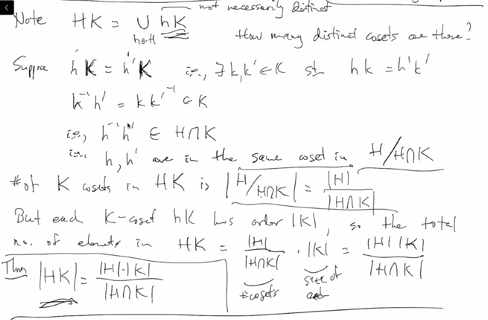
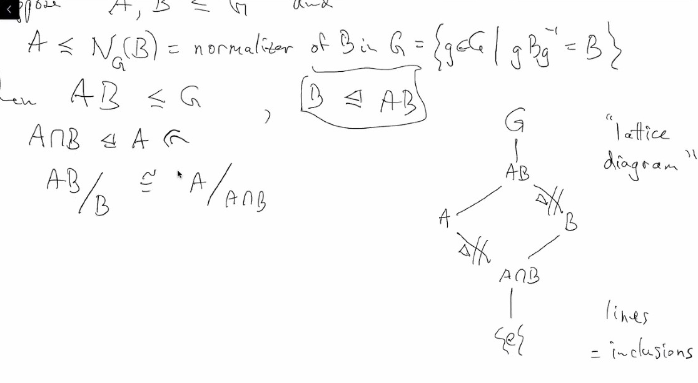
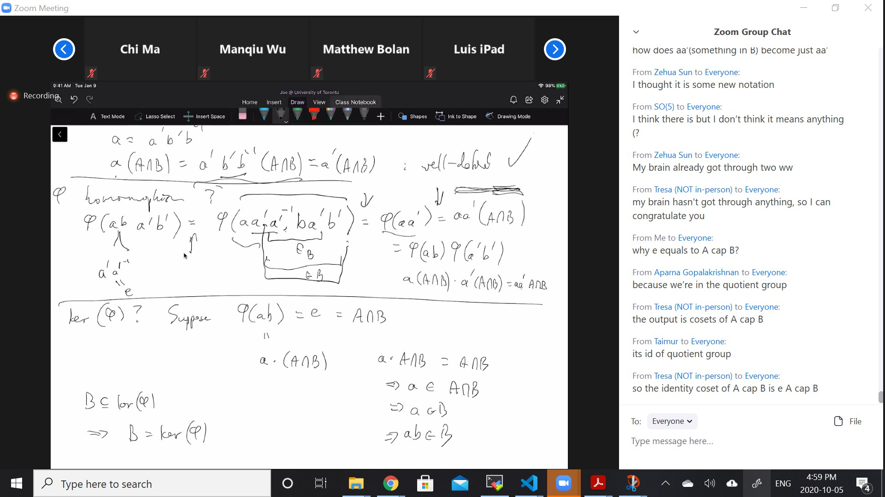
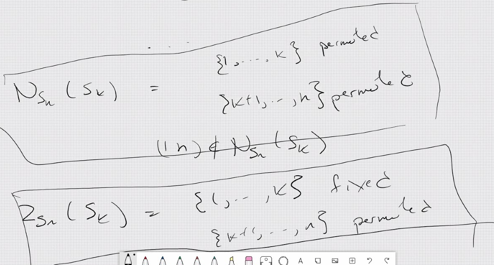

# Lec 8
#### Lemma: 
* If $H, K \le G,$ not necessarily normal
  * $HK$ is a subgroup iff $HK = KH$
* pf. 
  * suppose $HK \le G$, consider $hkh'k' \in HK$
    * thus $hlh'k' = h''k''$ and then you would know $kh' = h^{-1}h''k''k'^{-1} \in HK$, since $kh'$ are arbitrary elemnt, that is enough for $KH \subseteq HK$
    * and since $(hk)^{-1} = k^{-1}h^{-1}$ so we know $KH \subseteq HK$
  * suppose $HK = KH$, then for arbitrary $hk,h'k' \in HK$, $hkh'k' = hh'' k'' k' \in HK$. closure is done.
    * inverse closed since $(hk)^{-1}=k^{-1}h^{-1} \in KH = HK$
  * check other things yourself
***
* Now consider the cosets $HK / (H \cap K)$, even though $HK$ might not be a subgroup, we know $H \cap K$ is a subgroup
  * i.e. all left $H \cap K$-cosets
    * with representatives from $HK$
  * Note $HK = \bigcup_{h \in H}hK$, $h$ not necessarily distinct
    * how many distinct cosets are there?
  * Suppose $hK = h'K$, exists $hk = h'k'$ thus $h = h'k'k^{-1} \in h'K$
    * $h^{-1}h' = kk'^{-1} \in K$, thus $h^{-1}h' \in H \cap K
      * thus $h, h'$ are in the same coset in $H/H\cap K$
      * \# of K cosets in $HK$ is $|H/H\cap K| = \frac{|H|}{|H \cap K|}$
        * but each k-coset, hK has order |K, so that total number of elements in HK = $\frac{|H|}{|H \cap K|}$
      * 

***
### First Isomorphism THeorem
* Suppose $\phi : G \rightarrow H$ is a homomorphism
  * let $K = kernel(\phi) = \{g \in G : \phi(g) = e\}$ then
    * $K \trianglelefteq G$
    * $image(\phi) = \{\phi(g) : g \in G\} \cong G/K$
  * pf
    * Suppose $k \in K$, consider $gkg^{-1}$ since $\phi(gkg^{-1}) = e$, thus $gkg^{-1} \in ker(\phi)$
    * Define $Phi : G /K \rightarrow H$ by
      * $\Phi(gK) = \phi(g)$
      * need to show $\Phi$ is well-defined, that is $gK = g'K \iff \phi(g) = \phi(g')$
        * If $gK = g'K$, then there is $k,k'$ s.t. $gk = g'k'$ and thus $\phi(g) = \phi(g' )\phi(k'k^{-1}) = \phi(g)$, and since $image(\phi) = image(\Phi)$,
        * together with the fact that the above proof is actually iff, we know $\Phi$ is actually isomoprhism
        * we also need to show $\Phi$ is homomorphism, recall that $K$ is normal
***
#### Example: Figure out the below examples
* $\phi : \reals^2 \rightarrow \reals := (x, y) \mapsto x$
  * K = ker($\phi$) = y axis
  * $G / K$ are all the vertical lines
    * image is the x-axis
      * and you can see how isomorphism between cosets and x-axis appear
  * The homomorphism $\phi : G \rightarrow G/N$, $N \trianglelefteq G$ arbitrary normal subgroup
    * ia called the natural projection map, also called "factoring out N"
    * $\phi(g) = gN$
***
* In $G_1 \times G_2$, $N = G_1 \times \{e\}$ is a normal subgroup
  * $(G_1 \times G_2) / (G_1 \times \{e\}) \isomorphism G_2$
    * $\phi(g_1, g2) = g_2$ - also called projection
***
* $\phi : \reals \rightarrow$ circle
  * $\phi(t) = e^{2\pi i t}$
    * ker$(\phi)$ = $\mathbb{Z}$
    * $\reals / Z \cong$ circle
***
* $Q \subseteq \reals, Q \trianglelefteq \reals$, and $Q$ not topological closed
  * $\reals / Q$ is very hard to picture

#### Theorem : Second Isomorphism Theorem "Diamond Theorem"
* Suppose $A, B \le G$
  * $A \le N_G(B)$ = normalizer of B in G $\{g \in G : g B g^{-1} = B\}$
    * $B \trianglelefteq G \iff N_G(B) = G$
      * normalizer can be talked about on arbitrary subsets of a group
  * Then $AB \le G, B \triangleft AB$
  * Then $A \cap B \trianglelefteq A$
  * $AB/ B \cong A / A \cap B$
  * 
  * you need a intuitive understanding, at 4:36 pm
* pf
  * we know $AB \le G$ because $AB=BA$ because $A$ is a subgroup of normalizer of $B$
    * why $B \trianglelefteq AB$? we take $ab'b(b'^{-1} )a^{-1}= ab''a^{-1} \in B$, since $a \in N(B)$
    * $A \cap B \trianglelefteq A$ because if $x \in A \cap B$, then
      * $x \in A \implies axa^{-1} \in A$
      * $x \in B \implies axa^{-1} \in B$ since $A$ is a normalizer of B
  * we define $\phi : AB \rightarrow A/A\cap B := (ab)\mapsto a (A \cap B)$ it is of course onto, but do we know if it is well-defined?
  * suppose $ab = a'b'$, $a'^{-1}a = b'b^{-1} \in A \cap B$, thus $a'^{-1} a (A \cap B) = A \cap B$, then $a (A\cap B) = a'(A \cap B)$
  * then $\phi$ homomorphism?
    * $\phi(aba'b') = \phi(aa'a'^{-1}ba'b') = \phi(aa'(a'^{-1}ba' b')) = \phi(aa') = aa'(A \cap B) = \phi(ab)\phi(a'b')$
      * the first equality comes from inseting idertity
      * the second equality is because $(a'^{-1}ba' b') \in B$ and thus we can eliminate them by $\phi$'s definition
  * $ker(\phi)?$ Suppose $\phi(ab) = e$ thus $a(A \cap B) = e = A \cap B$, thus $a \in A \cap B$ and $ab \in B$.
    * Also, we know $B \subseteq ker(\phi)$ thus $ker(\phi) = B$
    * the $e$ is the identity of the quotient group
    * 
* 