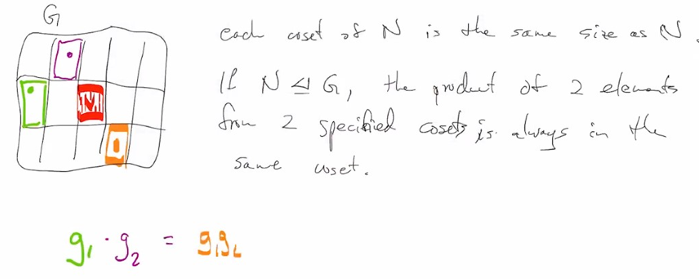
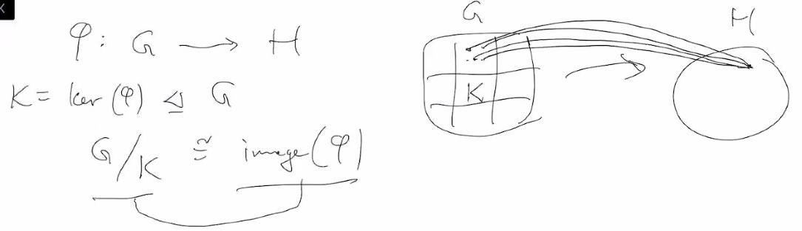
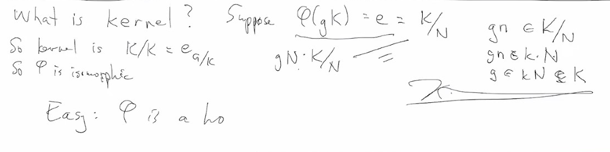
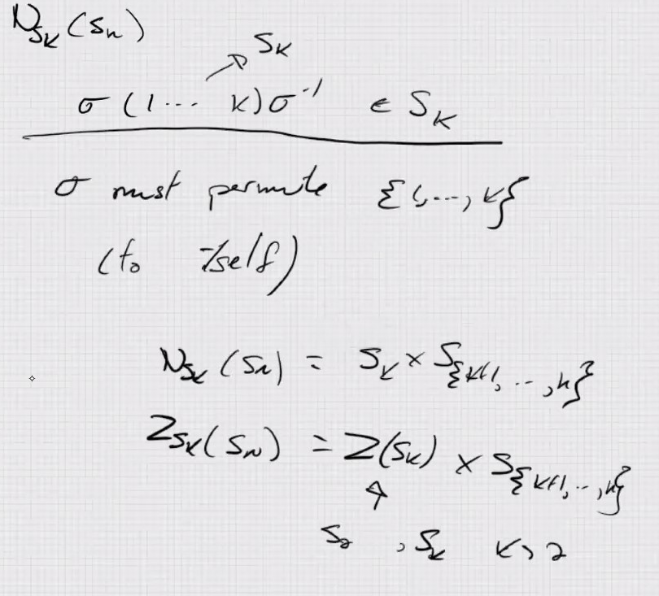

# Lec 9

### Intuition for quotient group:
* 
* This is basically saying we can give up thingking about
  * elements in coset
  * but directly think about cosets themselves, and binary operation is well-defined on these cubes
  * And that is the quoteint group $G/N$

***
### Two isomoprhism theorems
* $\phi : G \rightarrow H$ with $ker(\phi) \triangleleft G$
  * then $G / K \cong image(\phi)$
  * 
  * basically if you have two things in the same cosets, 
    * then they arrive to same point by $\phi$
    * basically if $gK = g'K$, then $g = g'k$ for some k
      * and thus $\phi(g) = \phi(g'k) = \phi(g')$

### Theorem: Third isomorphism theorme
* Suppose $N \triangleleft K \triangleleft G$
* and $N \trianglelefteq G$
  * Note: **normal subgroup is not transitive**
* then: 
  * $K/N \trianglelefteq G/N$
  * $(G/N) / (K/N) \cong G/K$
* Proof!
  * to use the fst isomorphism theorem
* Define $\phi: G / K \rightarrow (G/N) / (K/N)$
  * $\phi(gK) = gN \cdot (K / N)$
    * well-definedness?
      * $gK = g' K$ means $g = g' k$
      * thus $gN \cdot (K/N) = g'kN\cdot (K/N) = g'Nk\cdot (K/N) = g'N\cdot (K/N)$
    * so two computation expansion $g (K/N) = g\{kN : k \in N\} = \{gkN : k \in N\}$
      * $gN \cdot (K/N) = gN \cdot \{kN : k \in K\} = \{gNkN : k \in K\} = \{gkN: k \in K\}$
      * we know $gN \cdot kN = gkN$
    * ehat is the kernel?  $K/N$ is the identity
    * 

***
