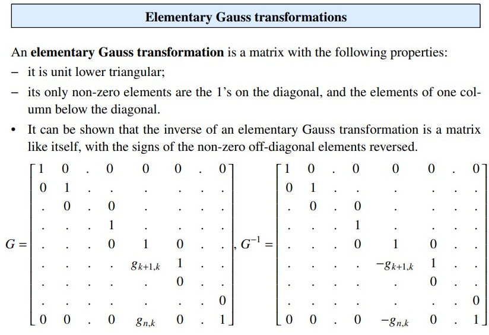
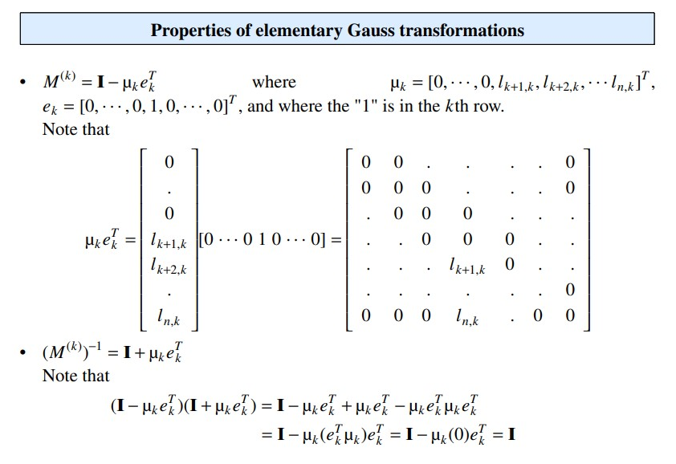
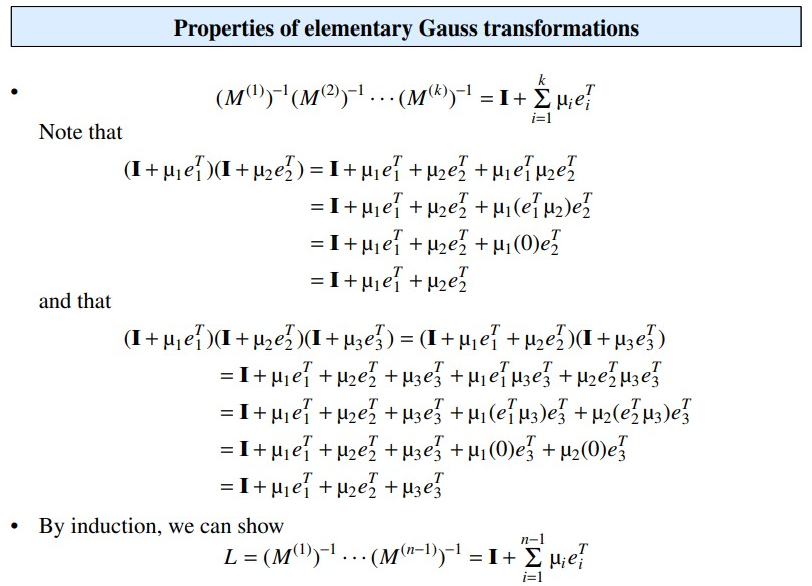

Use text searching please

* Orthogonal matrix:
  * $A^T A = I$
  * Orthogonal matrix doesn't have to be a square matrix
* Conjugate Transpose:
  * for $A \in Complex^{m \times n}$ where $(A^H)_{ij} = \bar{A_{ji}}$
* Hermitian:
  * $A^H = A$
* Note that for real matrices, we have $A^H = A^T$
* Unitary Matrix:
  * $A^HA = I$
  * If a matrix is square unitary, then its conjugate transpose is exactly its inverse
* Normal Matrix:
  * $A^H A = AA^H$
* Permutation Matrix:
  * A square matrix where there is exactly one 1 in each row and column and remaining are zeros
  * just permute rows when apply to left of the others; permute columns when apply to the right 
  * closed under product
* Elementary Permutation Matrix:
  * just change two rows
* Permutation Matrices are orthogonal
* Inner Product of vectors $x,y$:
  * $\langle x,y \rangle = x^T \cdot y$
* Orthogonal vectors $v_1,..,v_n$:
  * if $i\neq j$ then $v_i^T \cdot v_j = 0$
* Orthonormal vectors $v_1,..,v_n$:
  * orthogonal and $v_i^T \cdot v_i = 1$
* orthogonal vectors are linearly independent 
* Unit Upper/Lower Triangle Matrices:
  * Lower/Upper triangle with $1$'s on diagonal
* Strictly Lower Triangle Matrices:
  * $A_{ij} = 0$ for $i \le j$
* Strictly Upper Triangle Matrices:
  * $A_{ij} = 0$ for $i \ge j$
* Dense/Sparse Matrix: most of its elements are non-zero/zero
  * density: the ratio of the number of non-zero/zero elements over the total
* Banded matrix: a sparse matrix $A$ that has all its non-zero elements near the diagonal.
  * Its lower bandwidth is $l$ and its upper bandwidth $u$
    * if all elements below the $l$-th sub-diagonal and above the $u$-th super-diagonal are zero. 
    * In other words, $a_{ij}$ = 0, if $i − j > l$
or $j − i > u$.
  * (Full or total) Bandwidth: $l + u + 1$.
* Symmetrically banded matrix: a banded matrix with $l = u$.
* Semi-bandwidth of a symmetrically banded matrix: $l$ or $u$.
* Tridiagonal matrix: a symmetrically banded matrix with semi-bandwidth 1.
* Pentadiagonal matrix: a symmetrically banded matrix with semi-bandwidth 2.
* (Row) Diagonally dominant matrix: a square matrix $A$ for which $|a_{ii}| \ge \sum_{j=1 j\neq i}^n |a_{ij}|$ for all $i = 1,...,n$
* Strictly (Row) Diagonally dominant matrix: a square matrix $|a_ii| > \sum_{j=1 j\neq i}^n |a_{ij}|$ for all $i = 1,...,n$
  *  Strictly diagonally dominant matrices are nonsingular
* Positive definite matrix: a square matrix $A$ for which, for any vector $x \neq  0$, $x^T Ax > 0$.
* A symmetric matrix is positive definite (SPD), iff the diagonal elements of the U factor in the LU factorization are positive.
*  Non-negative (positive, non-positive, negative) matrix: $a_{ij} \ge 0$ $(a_{ij} > 0, a_{ij} \le 0, a_{ij} < 0$ respectively), for all $i, j$. 
   *  Notation: $A \ge 0 (A > 0, A \le 0, A < 0)$
*  Monotone matrix: a real square non-singular matrix $A$ for which $A^{-1} \ge 0$
*  M-matrix:
   * a real square non-singular matrix $A$ for which $a_{ij} \le 0$, for $i \neq j$, and $A^{-1} \ge 0$.
* when $M$ is singular/$\det(m) =0$/columns(rows) are linearly dependnet
  * then $Mx = b$ either have no solution or infinitely many solutions
***
* Gauss Elimination Linear System Solving:
  * (LU Factorization) (Gauss Elimination) $\frac{n^3}{3}$ pairs of additions and multiplication (flops)
    * and $\frac{n^2}{2}$ divisions
  * Forward Substitution: $\frac{n^2}{2}$ pairs of additions and multiplications (flops)
  * Back substitution:$\frac{n^2}{2}$ pairs of additions and multiplications (flops), and $n$ divisions.
  * Total : $\frac{n^3}{3} + 2 * \frac{n^2}{2}$ pairs of add + mult (flops) and $\frac{n^2}{2} + n$ divisions
  * Cost for solving $m$ linear systems of size $n \times n$ with the same matrix:
    * $\frac{n^3}{3}$  $+ m (\frac{n^2}{2} + \frac{n^2}{2})$ flops ((LU) and m(FS+BS)) 
      * and $\frac{n^2}{2} + mn$ divisions
* Elementary Gauss transformation:
  * During GE, the elements of matrices L and U, where L is unit lower triangular and U is upper triangular are generated, and the relation $A = LU$ holds. 
  * Moreover, $L$ is the product of the inverses of the $M^{(k)}$ matrices. The matrices $M^{(k)}$ are called elementary Gauss transformations.
  * Page II-88
  * Elementary Gauss transformation is close under inversion!
  * 
* Elementary Gauss transformation:
  * 
  * 
* LU factorization is unique:
  * $A = LU = L'U'$ if $L, L'$ are both unit lower triangle, then $L= L', U = U'$
  * $A = LU = LD\hat{U}$ where $\hat{U}$ is unit upper triangle and $D$ is diagonal
* LU factorization on Symmetric matrix:
  * each step $k$ of GE produces a symmetric $(n-k) \times (n-k)$ submatrix
  * computation lowers to $\frac{n^3}{6}$ flops
* For symmetric matrix $A$, LU factorization can lead to $A = LDL^T$
* For symmetric matrix $A$
  * $A$ is positive definite iff $A = LDL^T$ with diagonal $D$ that each entry is positive
  * Choleski factorization : For symmetric positive matrix $A$
    * $A =  LDL^T = (LD^{\frac{1}{2}})(LD^{\frac{1}{2}})^T = CC^T$
    * $C$ here as Choleski factor
***
* Compute Matrix multiplication:
  * For $A \in \Reals^{m\times n}, B \in \Reals^{n\times k}$
  * cost $mnk$ flops (1 flop = 1 add + 1 mult)
* Compute the inverse of matrix:
  * cost $n^3$ flops
    * Basically solving $AX = I$
    * Thus after LU factorization, we have $L_AU_AX=I$, ($\frac{n^3}{3}$)
    * thus solving $n$ linear system with RHS as $e_i = (0,0,...0,1,0,..0)$
      * $L_Ay_i = e_i; U_Ax=y_i$
      * During forward substitution on $y_i$, we know there will be a lot of zeros in $y_i$
        * as we know we ultimately are solving
        * $L_A[(y_i)_i] = I$, which means $[(y_i)_i]$ is a unit lower triangle
      * $\frac{n^3}{3}$ (LU) $+\frac{n^3}{6}$ (F/S) $+ \frac{n^2}{2}*n = n^3$
    * 
      * Thus compute inverse of unit lower triangle, we only need $\frac{n^3}{6}$
    * 
* Compute $A^{-1}B$ with $A \in \Reals^{n\times n}, B \in \Reals^{n\times k}$
  * cost $\frac{n^3}{3} + n^2k$
  * first LU factorization, and solve $k$ linear system (from each column vector from $B$)
  * Don't compute inverse directly unless it is explicitly asked
* Inverse of symmetric matrix is still symmetric
* Inverse of banded matrix is **not necessarily banded** 