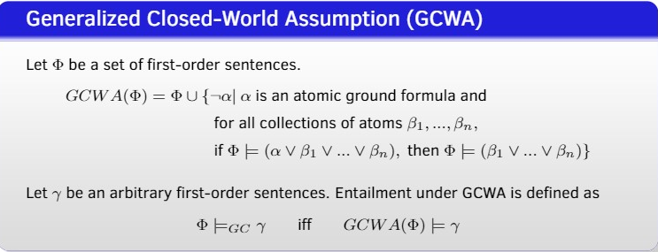
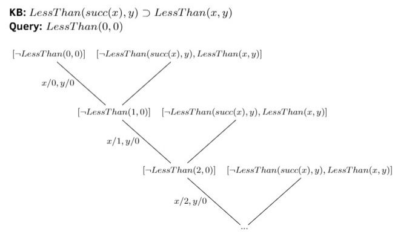
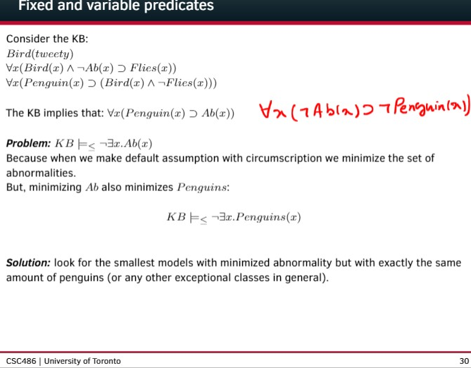
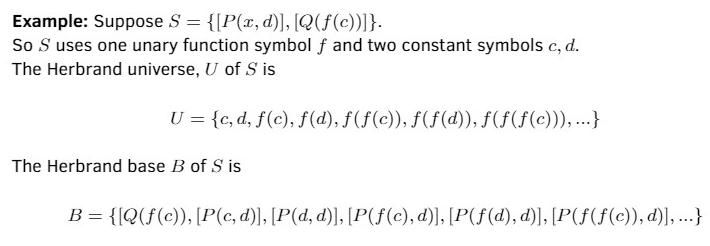

Use text searching please

* We care about entailment because we don't want all knowledge be in knowledge base
  * that would be too large
* Consistency is equivalent to satisfiability
  * $\Phi$ is consistent means $\Phi \not \models \bot$ 
  * which means $\exists M, M \models \phi, M \not \models \bot$
* Not Every consistent set is complete
  * $\{p \lor q\}$
* Not every complete set is consistent
  * $\{p, \neg p\}$
* every inconsistent set is complete
  * $\Phi \models \bot \models p, \neq p$
* First order Unsatisfiability (checking entailment) is semi-decidable but not decidable
  * First-order Unsatisfiability (checking entailment) is that 
    * given a set of sentences, we answer true if it is unsatisfiable; answer false otherwise
    * semi-decidable because resolution is refutation complete, and we can arrive at empty clause
    * but if the answer is false, then we may end up infinite loop
    * we usually use proof assistant/let human guide the unsatisfiability/entailment or just use less expressive language
* First order satisfiabiity is undecidable, not even semi-decidable
  * it is the co of the above question
  * we use propositionalize or Herbrand Theorem 
* Not every complete set of first-order sentences is decidable
  * Denote $N$ as the model for true arithmetic,
    * with addition, multiplication, successor function symbol, equality and less-than relation, and constant zero
    * $N \models k$ if $k$ holds in natural number arithmetic
    * It is proved that $Th(N) := \{x : N \models x\}$ is undecidable, because it is $Th(N)$ is not a recursive set and not recursive enumerable, and in fact it has no recursive set of axioms, (so enumeration of proofs is impossible)
    * it is easy to see it is a complete set of theory, because $N$ is a model
* CWA, closed-world assumption
  * $CWA(\Phi) = \Phi \cup \{ \neg \alpha : \alpha \text{ is ground atomic formula and } \Phi \not \models \alpha  \}$
* GCWA, generalized closed-world assumption
* 
* if $\Phi$ is a set of first order sentences (without quantifiers and equality symbols), $GCWA(\Phi)$ is not necessarily complete (w.r.t all the sentences generated from $\Phi$ w/o quantifier and equality)
  * Say $\Phi=\{p \lor q\}$, $GCWA(\Phi) = \Phi$ is still not complete
* if $\Phi$ is a set of first order sentences (without quantifiers and equality symbols), $CWA(\Phi)$ will be complete (w.r.t all the sentences generated from $\Phi$ w/o quantifier and equality)
* Reasoning under CWA is non-monotonic
  * $\{p \lor \neg p\} \models_{CWA} \neg p$ 
    * but $\{p \lor \neg p, p\} \models_{CWA} p$ as $CWA(\{p \lor \neg p, p\}) = \{p \lor \neg p, p\}$
* Reasoning under GCWA is non-monotonic
  * $\{p \lor \neg p\} \models_{GCWA} \neg p$ 
    * but $\{p \lor \neg p, p\} \models_{GCWA} p$ as $GCWA(\{p \lor \neg p, p\}) = \{p \lor \neg p, p\}$
* Horn Logic is still semi-decidable
  * Even with just Horn clauses,in the first-order case the possibility of generating an infinite branch of resolvents exists
  * 
* Circumscription is not easy to cause inconsistency
  * because we don't directly manipulate KB
* Issue with circumscription:
  * 
  * solution: 
    * Fixed / Variable Predicate
    * Mc Carthy's definition for Models with Minimal Abnormality
* Extension for Default Logic can be not complete
  * $\mathcal{F} = \{\beta\}, \mathcal{D} = \{ \alpha \Rightarrow \beta \}$
  * $\mathcal{F}$ is an incomplete extension
* Stable Expansion for Default Logic can be not complete
* $\mathcal{M} \models \phi [\sigma]$ means $\mathcal{M}$ with variable assignemnt $\sigma$ is satisfies $\phi$ 
  * $\mathcal{M} \models \phi [\sigma(m/x)]$ where $\sigma(m/x)$ is just like $\sigma$ except mapping $x$ to $m$
* Answer Extraction:
  * 
* During answer extraction, we create $\exists x. P(x) \land \neg A(x)$
  * when the result of $A(s)$ is proved,
  * it is not possible to have something like $A(s) \land \neg P(s)$
    * Say there's a constant a in the KB such that $\neg P(a)$ holds, and we're extracting answers that satisfy $P$. 
    * Then we must resolve the literal $\neg P(x)$ in the clause $[\neg P(x),A(x)]$ with some ground literal like $P(b)$ (where $b$ is some constant) somewhere in the extraction resolution to get the resolvant $[A(b)]$, but it's not possible to resolve $\neg P(a)$ with $\neg P(a)$ as they both are negative literals.  
  * Similarly, if $A(a)$ is the result, then we must have derived $P(a)$ otherwise $\neg P(a)$ in the clause is not resolvable
* Resolution, convert to Clausal Form
  * 
* Resolution tree, example  
  * 
  * 
* Resolution is sound but not complete
  * it is refutational complete
    * i.e. $S \rightarrow [] \iff S \models \bot$
  * thus with this we can calculate entailment by using refutation (to see if we can arrive contradiction)
    * $\Phi \cup \neg \alpha \models [] \iff \Phi \models \alpha$
* A set of propositional formulas (with finite vocabulary) is always decidable
* Herbrand Universe, Herbrand Theorem, Herbrand Base
  * 
  * 
  * Herbrand Theorem
    * Theorem: $S$ is satisfiable iff Herbrand base of $S$ is.
  * Herbrand Base doesn't have variable, but could be infinite (when there is function of arity more than zero), basically propositionalized
    * when it is finite, we can use SAT to solve them
    * SAT is still NP-complete problem
* Horn clause:
  * a clause with at most one positive literal
    * positive/negative literal
    * definite literal = positive literal
  * Still undecidable, semi-decidable, see above
  * SLD -- linear complexity to the KB size (if terminates)
    * each resolvent comes from resolving one precedent with one from KB
  * Backward Chaining - goal oriented (starting from query)
  * Forward Chaining - derive all possible implication