# Lec 38

# RCF/JCF
* $F$ is a field: an $F[x]$-module $V$ is a vector space over $F$
  * and a linear transformation $T : V \rightarrow V$ s.t. $x \cdot v = T(v) \forall x$
* The fundamental theorem says that
  * We can write $V =_{F[x]}F[x]/(a_1(x)) \oplus F[x]/(a_2(x)) \oplus F[x]/(a_3(x)) ... \oplus F[x]/(a_m(x))$
    * with $a_1 \| a_2... \| a_m$
  * If we insist that each $a_i(x)$ is monic, then they are uniquely determined by $T$
  * so the combination of monoic and divisible condition is pretty strong
  * Notice that $Ann(V) = (a_m(x))$
  * 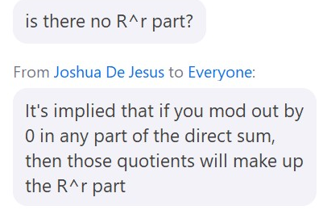
* There are some issues when above $a_m(x) = 0$ around 3:35pm
  * seems like annhilator of free module is just zero
***
### Definition: The minimal polynomial
* The minimal polynomial of a transformation $T$ of a matrix $A$ is the monic polynomial of lowest degree s.t.
* $p(T) = 0$ or $p(A) = 0$
  * or notation: 
  * $m_T(x)$ or $m_A(x)$
***
* 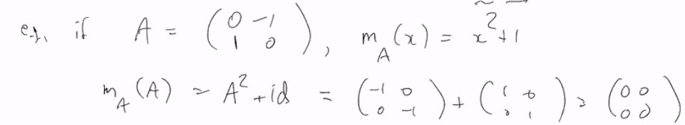
***
* Notice that $a_i | m_A(x)$, $i = 1,..,n$
* Choose a basis for $F[x]/(m_A(x))$, $n = deg(m_A(x))$
  * $1,x,...,x^{n-1}$ (actually are cosets $1+ (m_A), x + (m_A)...$)
* $x$ acts in a simple way: $x : 1 \mapsto x, x \mapsto x^2...$
  * what does $x$ do to $x^{n-1}$? Of course takes it to $x^n$
    * $m_A(x) = x^n + b_{n-1}x^{n-1} + ... + b_1x + b_0$
    * $m_A(x) = 0$ in $F[x]/(m_A(x))$
### Definition: campanion matrix
* 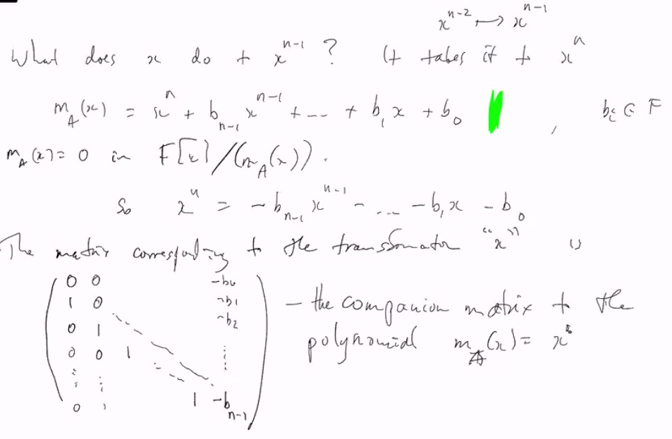
* If $p(x)$ is any non-constant polynomial, this works for $F[x]/(p(x))$ turns out that $p(x) = m_T(x)$ where $T$ means multiply by $x$

***
### Rational Canonical Form (RCF)
* A matrix/transformation is in $RCF$ if 
* 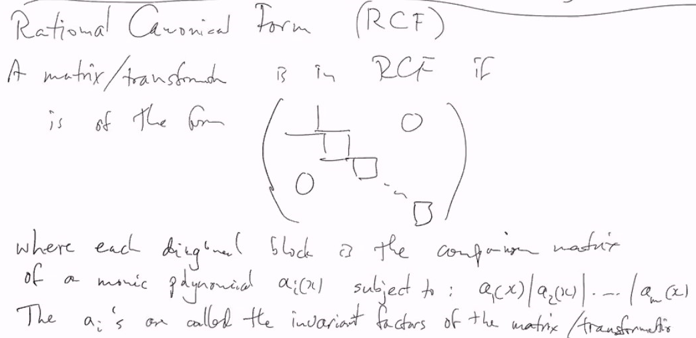
  * those blocks on the diagonal are bigger and bigger (because degree larger)
* The $a_i$'s are called the invariant factors of the matrix/transformation
  * $RCF$-uniquely determined by the matrix/transformation
* matrices: $A, B$ are similar iff their RCFs are the same
***
### Example:
* $A = (0 -1; 1 0)$ $m_A(x) = x^2 + 1$, the campanion matrix is just $A$
* $p(x) = x(x^2+1) = x^3 + x$, $V \cong F[x]/(x^3+x)$, 3-dimensional
  * Thus $RCF = (0 0 0; 1 0 -1; 0 1 0)$
  * 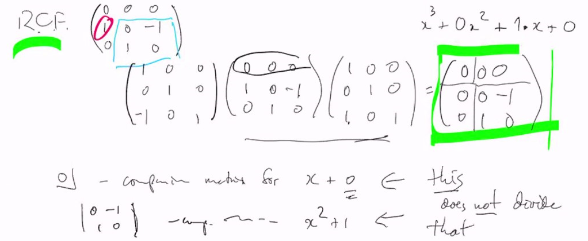
  * the green matrix looks like a RCF but it is not actually because $x+0$ doesn't divide $x^2+1$
* 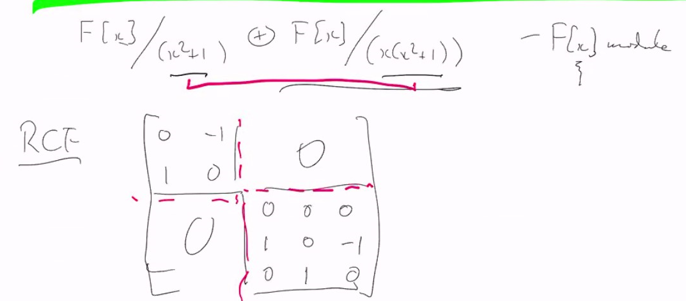
  * the campanion matrix to $p(x)$ is singular iff $p(0) = 0$ iff $x$ divides $p(x)$
    * it is not the irreducibility that causing the campanion matrix invertible/singular

***
### Example
* Suppose $A$ is a real matrix, with $RCF$ $R$
  * $A'$ is the same matrix as a complex matrix, with (complex) RCF $R'$ 
  * Can $R$ and $R'$ be different?
    * No : $R$ is a RCF over $R$ so it is also a RCF over $C$
      * by uniqueness of RCF, $R' = R$
***
* If $F$ is any field, $F \subseteq K$ field
  *  If $A \in M_n(F)$, then its RCFs over $F$ and $K$ are the same
  *  The RCF of $A \in M_n(F)$ is in $M_n(F)$
  *  any matrix over any field has a RCF

### Contrast:
* 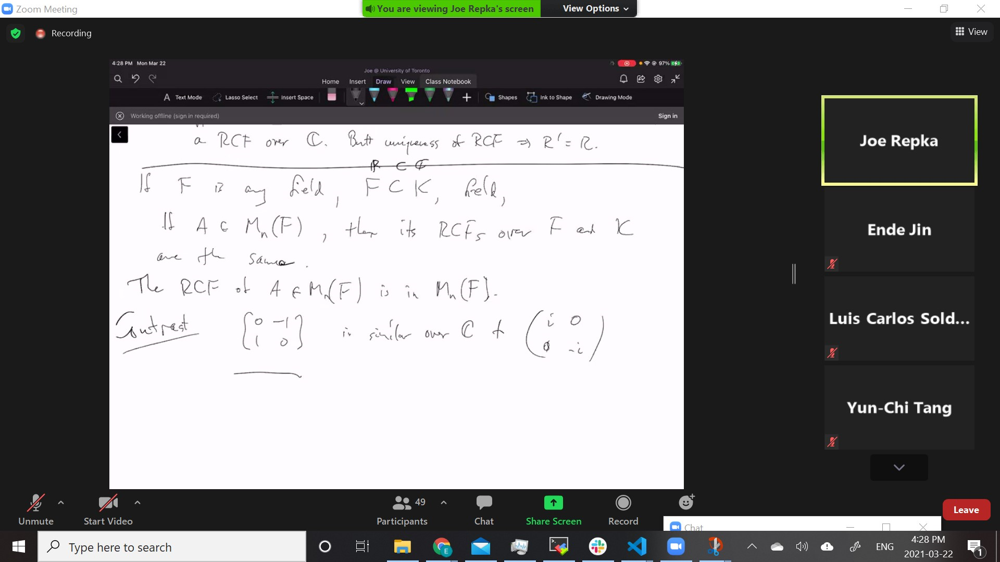

### Easy (cute)
* Charateristic polynomal of $A$, $\det(\lambda I - A)$ turns out to be $\det(\lambda I - A) = \Prod_i a_i(\lambda)$ the product of the invariant factors
* Easy part: 
  * companion matrix: $\det(\lambda I - A) = p(\lambda)$ if $A$ is the companion matrix of $p(x)$
  * (determinants)

### Theorem: Cayley-Hamilton Theorem:
* If $A$ is a square matrix, then $m_A(A) = 0$
* If .... then charateristic polynomial of $A$, $p_A(A) = 0$ 
  * it is actually $m_A \| p_A$ the characteristic polynomial
  * 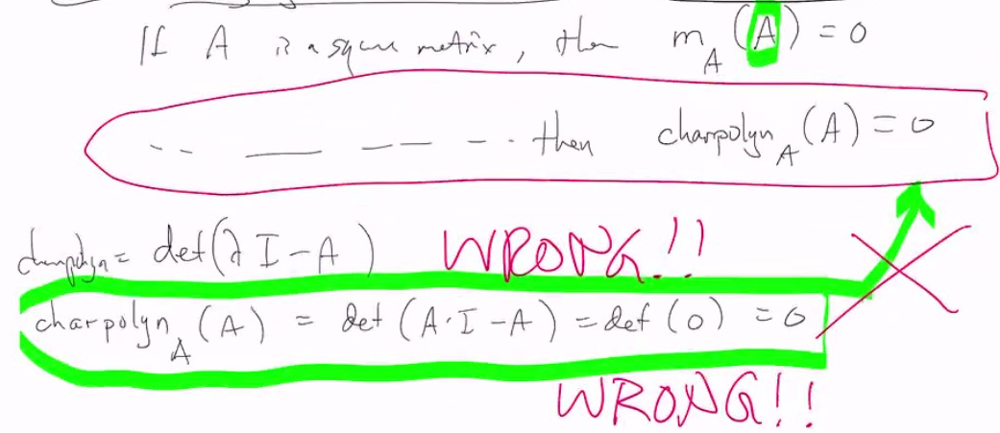
  * 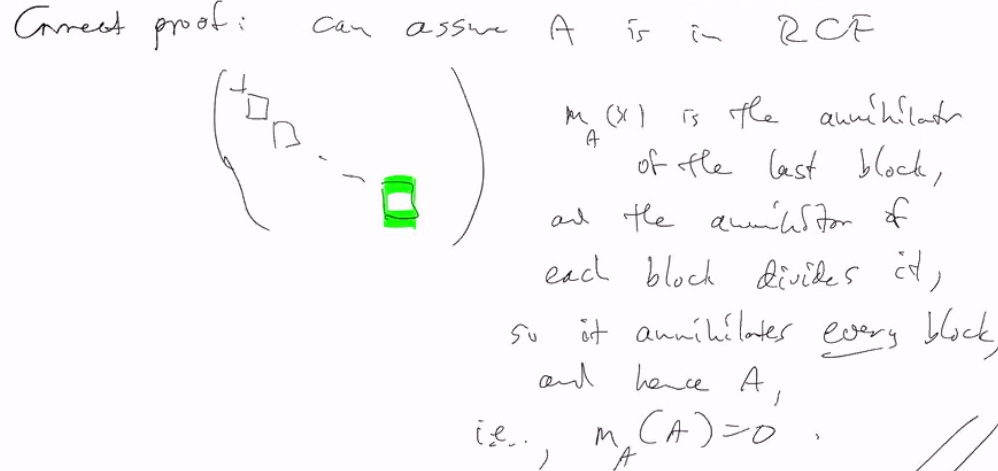
* 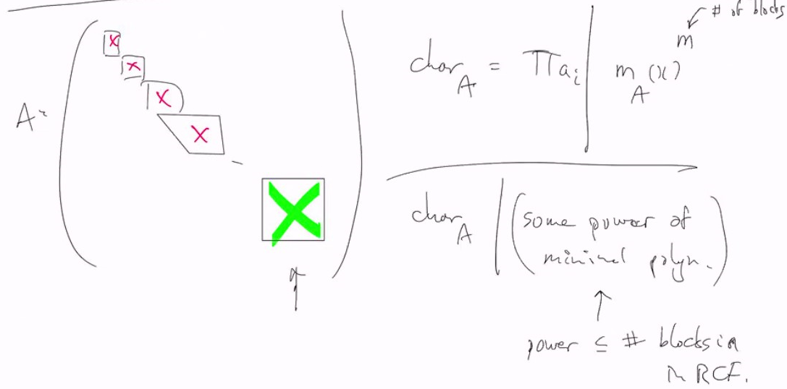
  * the green matrix corresponds the minimal polynomial
  * so characterstic polynomial has the same roots as minimal polynomial but not necessarily same multiplicity

### Relation to Jordan Canonical Form
* 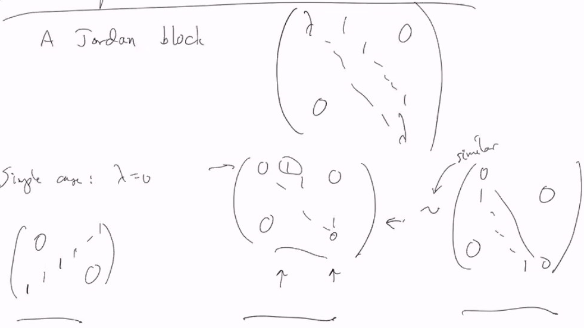
***
* $p^{-1}(\lambda I)p = \lambda I$ so
  * 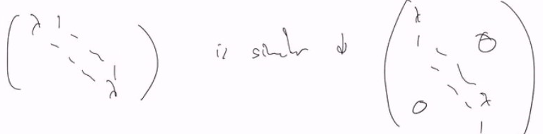
  * 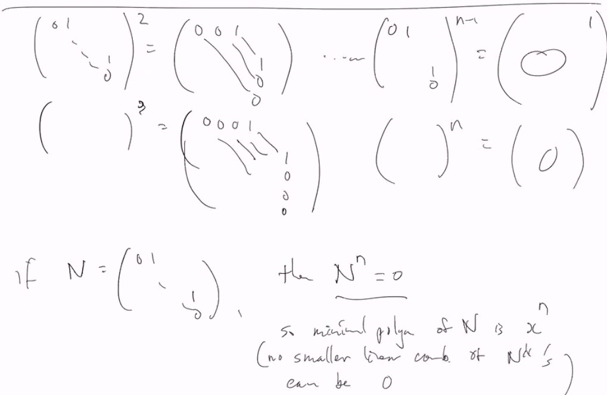
  * 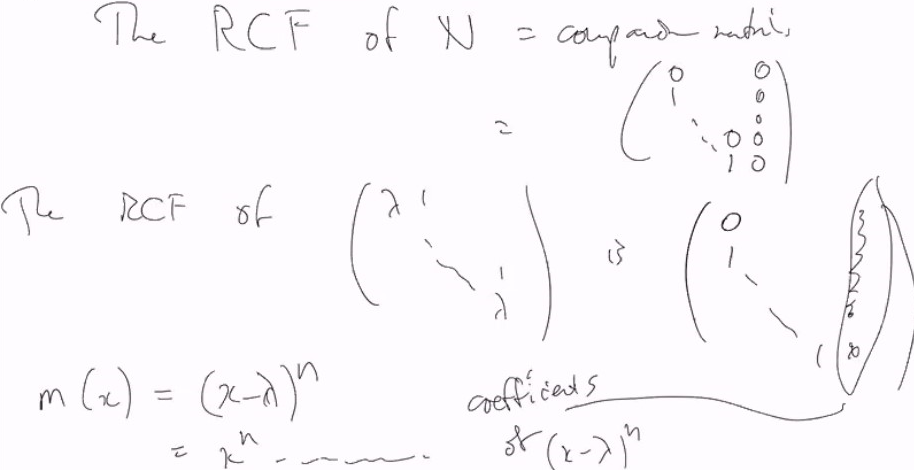
  * 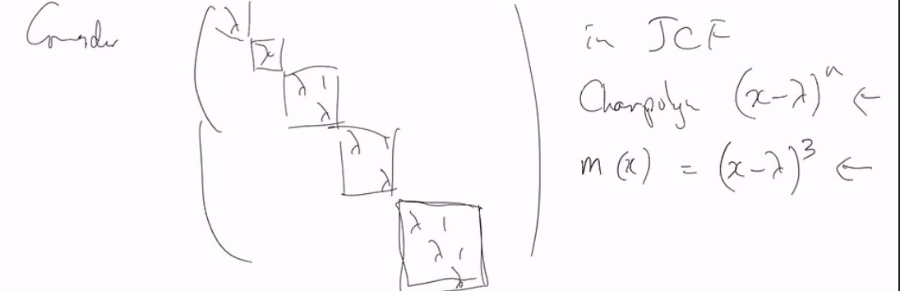