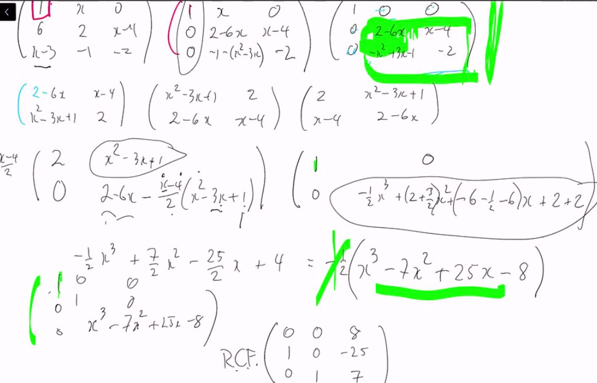

# Lec 38
### 
* We can have charactersitc polynomial $\det(\lambda I - A)  = \Prod a_i(x)$ for a matrix $A$
* Recall the invariant factors $a_i | a_{i+1}$
* these factors are unique and determine similarity class
* if we have a invariant factors, we know the campanion matrix and then we know the RCF

### The algorithm that produce RCF
* 
* want to diagonalize $xI - A$ and preserve determinstic (characteristic polynomial)
* the strategy is that we know $xI - A$ is similar to the blue matrix
  * so if we apply row/column operation (elementary operation), we won't change much in determinant, thus we can arrive at blue matrix
  * Why it is always we will arrive that $a_i | a_{i+1}$
* 
***
