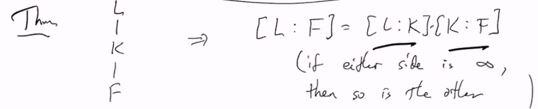

# Lec 40
# Galois Theory
* Textbook is much easier to read in this section

### Solving Polynomial
* $x^2 - 2,...$ quadratic/cubic/quartic/quintics formula
***
* $x^2 - 2$ -> $\pm \sqrt{2}$
* $x^2 - 8$ -> $\pm 2\sqrt{2}$
* insight : instead of solving a fixed polynomial, 
  * we should look at 
  * $Q(\sqrt{2})$
### DefinItion: Field Extension
* $F \subseteq E$ both fields
  * we say $E$ is an extension field of $F$
  * $F$ is a subfield of $E$
* then we write $E/F$ to mean $E$ is an extension field of $F$
***
* If $E/F$ then $E$ can be regarded as a vector space over $F$
  * $deg(E/F) = [E : F] := dim_F(E)$
    * for us, usually $[E:F] < \infty$; finite extension
  * e.g. $[Q(\sqrt{2}), Q] = 2$
    * but $[R: Q] = \infty, [C : R] = 2$
### Definition: characteristic 
* The characteristic of a field $F$ is the smallest $n \in N$ s.t. $n \cdot 1_F = 0$
* e.g. $ch(Z/pZ) = p$
* If there is no $n \in N$ s.t. $n \cdot 1_F = 0$,
  * then we say $ch(F) = 0$
  * e.g. $ch(Q) = ch(R) = ch(\Complex) = 0$
* Finite Fields must have finite characteristic
***
* If $ch(F) \neq 0$, then it has to be a prime number
  * e.g. $ch(Z/pZ) = p$
### Theorem:
* For any prime $p, n \in N$,
  * there exists a finite field of chacteristic $p$ and cardinality $p^n$ 
  * and they are unique up to isomorphism
    * determined by $p, n$
***
* $(Z/pZ)[x]$ is PID
  * The quotient field of $(Z/pZ)(x) =$ rational functions over $Z/pZ$
    * is infinite but of characteristic $p$

### Theorem:
* Given any field $F$, there is a ring homomorphism
  * $\phi : Z \rightarrow F := n \mapsto n \cdot 1_F$
* $ker(\phi) = ch(F) \cdot Z$

### Definition: Prime Field
* In any field $F$, the prime field is the field guaranteed by $1_F = \phi(1)$
* A field is called a prime field if it has no proper (i.e., strictly smaller) subfields
### We can find an extension of $F$ for irreducible $p$ to have root
* If $ch(F) = 0$, the prime field is sio to $Q$
* The prime field of $(Z/pZ)(x)$ is $Z/pZ$
* If $p(x) \in F[x]$, $p$ irreducible then
  * note $p(x) = x^{n} + a_{n-1}x^{n-1} + ... + a_0$
  * $K = F[x]/(p(x))$ is a field and $K/F$ constant polynomial
* Say $p(x)$ is monoic
  * let $\theta = \bar{x}$
  * then $p(theta) = (p(x)) = \bar{0}$
    * i.e. $p(\theta) = 0$ in $K$
* **Given irreducible $p \in F[x]$, some $K/F$ in which $p$ has a root**
***
* Also $1, \theta, \theta^2,...,\theta^{n-1}$ are a basis for $K/F$
  * (need to check linear independence)
***
*  $K = \{a_{n-1}\theta^{n-1} + a_{n-2}\theta^{n-2}... : a_i \in F\}$
   *  $[K:F] = n = deg(p(x))$
***
* if $f$ is not irreducible, factor it $f=\Prod_i p_i^{m_i}$
  * can find an extension $K/F$ in which some $p_i$ has a root
    * so $F$ does too
***
### Proposition: 
* Suppose $\phi: F \rightarrow F'$ is an isomorphism of fields
  * then $\phi$ extends to a homomorphism $F[x] \rightarrow F'[x]$
    * by applying to coefficient
* e.g. $F = Q$ $x^2 - 2$, -> $Q[\sqrt{2}]$
  * $x^2 + 1$, -> $Q(i)$
* Given irreducible $p$, $K=\{a_0 + a_1 \theta  + ... a_{n-1}\theta_{n-1} : a_i \in F\}$
  * addition is obvjious
  * for multiplication, multiply polynomials as usual then ue the Euclidean Division alg to get the remainder
  * Division: Since $a_0 + a_1 \theta  + ... a_{n-1}\theta_{n-1} = 0$
    * thus $\theta(\theta^{n-1} + a_{n-1}\theta^{n-2} ... ) = -a_0$
    * then we know the inverse for $\theta$
  * Thus $K$ is really a field
### Definition: 
* If $K/ F$, $a,b,... \in K$
  * then $F(a, b, ...)$ is the smallest subfield of $K$ containing $F, a, b,...$
### Theorem: (???)
* A field $F(\alpha)$ is called a simple extension
  * If $p$ is irreducible polynomial over $F$, $a \in K \supseteq F$ s.t. $p(a) = 0$
  * then $K - F(a) - F$ and $F(a)$ is the smallest such intermediate field between $F$ and $K$
    * what smallest?
* $R - Q(\sqrt{2}) - Q$
  * $p(x) = x^3 - 2$ irreducible by Eistein Criteria
    * one real root $2^{1/3}$
    * 
  * The correspondence between subgroup and subfields is the core of Galois Theory

### Theorem: Uniqueness of Extension
* If $\phi : F \rightarrow F'$ isomorphism extend it to $\phi: F[x]\rightarrow F'[x]$ ($\phi$ acts on coefficient)
  * Suppose $\exists K/F$ and $\alpha \in K$ s.t. $p(\alpha) = 0$
    * then $\exists \Phi : F(\alpha) \rightarrow F'(\alpha')$ isomorphism
      * with $\phi(p)(\alpha') = 0$, and $\Phi|F = \phi$ 
* Proof. easy
***
### Definition: "Algebraic"
* $\alpha \in K$, $K/ F$ is "algebraic over" $F$ if $p(\alpha) = 0$ for some non-zero polynomial $p(x) \in F[x]$
  * if not algebriac then it is transcendental
  * $\sqrt{2}$ alg over $Q$
***
* If $a \in \Complex$ is algebriac over Q
  * it must be a root of a rational polynomial
* But there are only countably many rational polynomials
  * each with finitely many roots
    * so there are only countably many algebraic numbers in $Q$
    * thus almost everything in $R$ or $R$ is transcendental
* of course $e, \pi$ are algebriac over $\reals$
### Definition: minimal polynomial of $a$ over 
* Suppose $a \in K$ is algebraic over F
  * there exists a unique monic polynomial $m_{a, F}(x) \in F[x]$ 
  * s.t. $m_{a, F}(a) = 0$ and $f(a) \neq 0$ for any other monic polynomial of degree not exceeding $deg(m_{a, F})$
* this is called  minimal polynomial of $a$ over $F$
  * In this situation, $deg(a) = deg(m_{a,F}) = [F(a) : F]$
  * i.e. $F(a) \cong F[x]/(m_{a, F}(x))$
***
### Corollary:
* If $0 \not \equiv f \in F[x]$ s.t.
  * $f(a) = 0$, then $m_{a, F}(x) | f(x)$
* If $L/F$ and $a$ is algebraic over $F, L$
  * 
***
### Theorem: 

### Corollary: 
* $L - K- F$, then $[K:F] | [L:F]$
### Definition: 
* A field of the form $K(a_1,..,a_k)$ is called finitely generated over $F$
### Lemma:
* $F(a, b) = F(a)(b) = F(b)(a)$
* $F(a_1,..,a_n) = F(a_1)(a_2)...(a_n)$
***
### Theorem:
* $K/F$ is finite iff $\exists a_1,..,a_k \in K$
  * s.t. $K = F(a_1,..,a_k)$
    * In this case:
      * $[K:F] \le deg_F(a_1) \cdot deg_F(a_2) ... deg_F(a_k)$
### Theorem:
* If $a, b$ are algebriac over $F$
  * then so are $a+b, a-b, ab, a/b, \frac{1}{a}$ are all algebraic over $F$
* It is interesting exercise
***
* The set of all algebraic over field can become a field
  * e.g. the set of all algebraic over rationals is still countable but as an infinite extension 
### Definition: Composite
* 
* $Q(2^{1/3}) \cdot Q(\omega) = Q(2^{1/3}, \omega)$
* 
***

*** 
* Read Section 14.3 yourself!
  * Ruler + Compass Construction