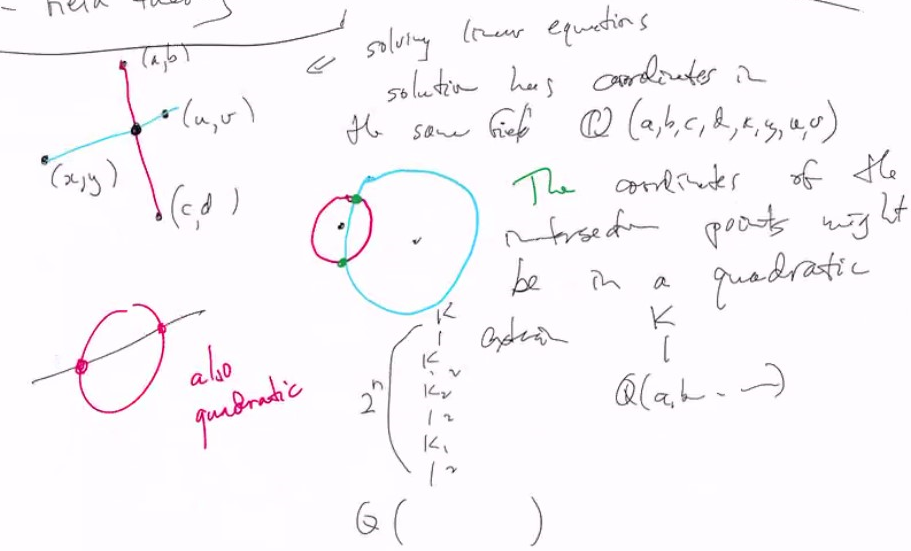

# Lec 41
* Rule + Compass Construction
* basically we just have these two tools

* Can we draw a square has same area as circle?
* Can we trisect arbitrary angle?
* find a cube same volumn as a ball

### The proof of the above are impossible
* Descartes - 
  * Greek geometry
  * coordinates/number and algebra
* Field Theory -
  * if you have four points and their coordinates
    * and draw two lines and to find their intersection
    * bescailly solving linear equations
    * solution has coordinates in the same field $Q(a,b,c,d,x,y,u,v)$
    * 
      * always a quadratic extension of a field
    * But if you want to trisect an arbitrary angle, say $60$ degree, but $\sin 20$ and $\cos 20$ is in a cubic extension, so it is impossible to construct arbitrary trisection

### Solving the polynomial
* Suppose $f(x) \in F[x]$
  * join the field with one root of a equation doesn't necessarily include other roots
    * say a cubic root joining $Q$ is at most Reals, but complex root is not inside

### Definition: Splitting the field

### Theorem: 
* Given $f \in F[x]$
* there exists a splitting field $K/F$
* Pf: we know there is $k_1/F$ s.t. there is $a \in K$ s.t, $f(a) = 0$ (extending with one root first)
  * so $f(x) = (x-a)f_2(x)$ where $f_2(x) \in K_1[x]$
    * and $\deg f_2 < \deg f$
    * thus we can continue by induction
    * Continue, we can get a field the has all the roots, but no necessarily the splitting field (the smallest one)
    * but we have prove there is at least one field with all the roots, then we just intersecting all this kind of field
### Prop:
* Suppose $\phi : F \rightarrow F'$ isomorphism
  * $f \in F[x] \mapsto f' \in F'[x]$ ($\phi$ acts on coefficient)
* If $K/F$ is a splitting field for $F$, then $\phi$ can be extended to $K \rightarrow K'/F$ in such a way that 
  * $f'(\phi(a_i)) = 0$ for each root $a_i$ of $f(x)$ so $K'/F$ is a splitting field of $f'$

### Corollary: Splitting field of $K/F$ is unique
### Example
* $f(x) = x^2 - 5 \in Q[x]$ with $a = \pm \sqrt{5}$
  * $Q[\sqrt{5}]$ is a splitting field
* 
* the reason that is $\sqrt{-3}$ because
  * 
* $x^2 + 1 \in R[x]$

***
### Example:
* If $f \in F[x]$, deg(f) = n
  * and K/F is its splitting field
* look for one root: $K_1 = F[x]/(f(x))$, with extension degree at most $n$ upon $F$
* next step: $f = (x-a)f_2(x)$ , deg(f_2) = n-1
  * using same quotient technique as above, then extension degree will be at most $n-1$
### Theorem:
* If $K/F$ is a splitting field of $f(x)$, 
  * then $[K : F] \le n!$
### The n-th root of unity
* $e^{2\pi i k /n}$
  * 

### Definition: primitive n-th roots of unity

* if $z = e^{2\pi i /n}$, then the primtitve ones
  * are $z^k$ with $(k,n) = 1$
* if $n$ is prime, then every unity root is primitive unity root

### Definition:
* An extension K/F is a cyclotomic extension if it is generated by roots of unity

### Theorem:
* If $z$ is a primitive n-th root of unity,
  * then $[Q(z) : Q]=\phi(n) = \|(Z/nZ)^\times\|$
    * the Euler $\phi$
### Example
* $x^p - 2$, $p$ prime

generalize the case with $p=3$