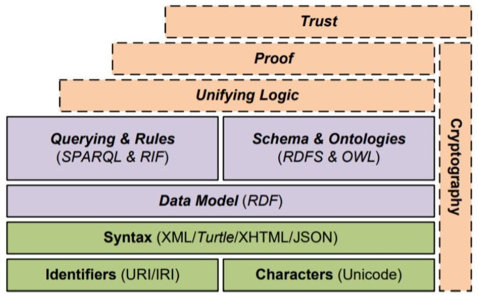
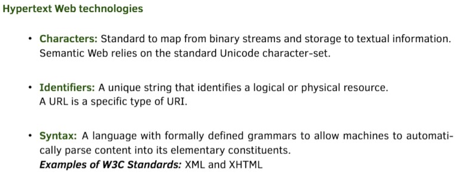
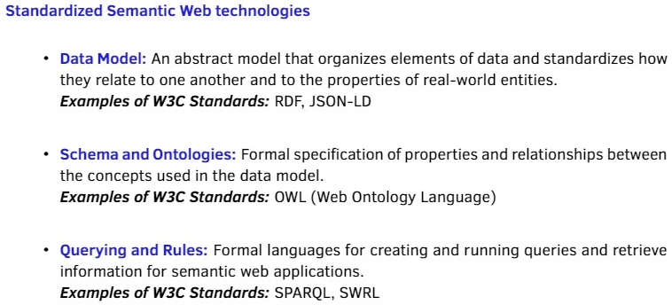
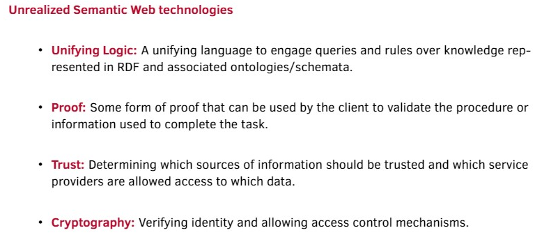
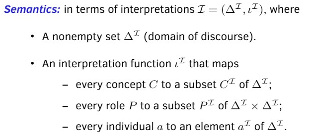
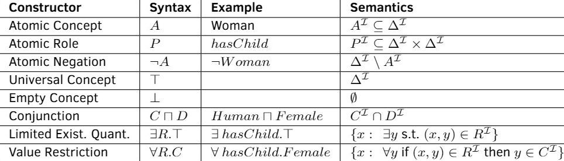
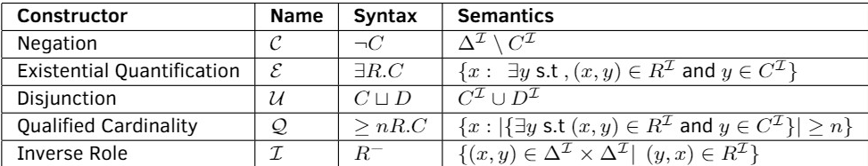

Use text searching please

## Semantic Web
* semantic web goal:
  * Describe and link web content in a manner that's meaningful to machines
  * extend the original/current World Wide Web with semantic web
* Semantic Architecture:
  * 
  * Green - Realized; Purple - In Progress; Orange -- Not yet started
  * Trust, Proof, Unifying Logic,
  * Query & Rules, Schema & Ontologies; Data Model
  * SPARQL & RIF, RDFS & OWL
  * Syntax, identifiers, characters
    * 
    * 
    * 
* RDF triple:
  * consist of subject, predicate, object
    * which will link its subject to an object, and predicate is along the edge
* RDF graph -- a collection of RDF triple
  * subject, objects are nodes
    * predicate as edges
  * But no meaning, needs a formal ontology
* Formal Ontology
  * provide a computer-interpretable specification of the intended meanings of terms.
  * a computer-interpretable specification for data that captured in the RDF graph
  * An ontology is a formal description of the concepts and relationships within a specific domain.
  * general properties
  * a lot of 
  * reusable
  * common language
* Web ontology is using Description Logic based languages
  * there are also first order ontologies
* Knowledge Graph are with two components:
  * a Data Graph : Usually RDF graphs are used as the data graph to structure data.
  * Ontologies: Represent the formal semantics of a KG
    * together describe concepts and relationship that are used in the data
    * able to give structure to the data
    * enable reasoning about the data

## Description Logic:
* a strict subset of First Order Logic
* classification, subsumption, hierarchical information
* Domain are individuals
* Concepts: a set of individuals (unary predicates)
* roles : binary relationships  (binary predicates)
* constructors : like connectives
* Descriptions : Variable-free expressions which can be built up from primitive symbols in the vocabulary using constructors.
* Semantics
  * 
* $\mathcal{AL}$  Language, AL language
  * 
* Extension of $\mathcal{AL}$
  * 
* Terminological Sentences:
  * subsumption: $C \sqsubseteq D$ : $C^I \subseteq D^I$
  * Definition: $C \equiv D$ : $C^I = D^I$
* Assertion Sentences:
  * concept assertions: $A(c)$ : $c^I \in A^I$
  * role assertion: $R(c,d)$ : $(c^I,d^I) \in R^I$
* Terminological Knowledge Base (TBox)
  * A set of terminological sentences.
* Assertional Knowledge Base (ABox)
  * A set of assertional sentences.
* Basic Reasoning Task: for knowledge base $K = \langle T, A \rangle$
  * Concept Satisfiability on $T$
    * :find a model $I$ s.t. $I \models T$ where $C^I \neq \emptyset$
  * Subsumption, Equivalence, Disjointness on $T$: All to prove $T \models ...$
  * satisfiability on $K$: find model of $K$
  * is $K \models C(a)$ assertional?
  * Reductions:
    * $C$ is unsatisfiable iff $C \sqsubseteq \bot$
    * $C \equiv D \iff C \sqsubseteq$