Use text searching please

## Semantic Web
* semantic web goal:
  * Describe and link web content in a manner that's meaningful to machines
  * extend the original/current World Wide Web with semantic web
* Semantic Architecture:
  * 
  * Green - Realized; Purple - In Progress; Orange -- Not yet started
  * Trust, Proof, Unifying Logic,
  * Query & Rules, Schema & Ontologies; Data Model
  * SPARQL & RIF, RDFS & OWL
  * Syntax, identifiers, characters
    * 
    * 
    * 
* RDF triple:
  * consist of subject, predicate, object
    * which will link its subject to an object, and predicate is along the edge
* RDF graph -- a collection of RDF triple
  * subject, objects are nodes
    * predicate as edges
  * But no meaning, needs a formal ontology
* Formal Ontology
  * provide a computer-interpretable specification of the intended meanings of terms.
  * a computer-interpretable specification for data that captured in the RDF graph
  * An ontology is a formal description of the concepts and relationships within a specific domain.
  * general properties
  * a lot of 
  * reusable
  * common language
* Web ontology is using Description Logic based languages
  * there are also first order ontologies
* Knowledge Graph are with two components:
  * a Data Graph : Usually RDF graphs are used as the data graph to structure data.
  * Ontologies: Represent the formal semantics of a KG
    * together describe concepts and relationship that are used in the data
    * able to give structure to the data
    * enable reasoning about the data

## Description Logic + Rule Languages:
* a strict subset of First Order Logic
* classification, subsumption, hierarchical information
* Domain are individuals
* Concepts: a set of individuals (unary predicates)
* roles : binary relationships  (binary predicates)
* constructors : like connectives
* Descriptions : Variable-free expressions which can be built up from primitive symbols in the vocabulary using constructors.
* Semantics
  * 
* $\mathcal{AL}$  Language, AL language
  * 
* Extension of $\mathcal{AL}$
  * 
* Terminological Sentences:
  * subsumption: $C \sqsubseteq D$ : $C^I \subseteq D^I$
  * Definition: $C \equiv D$ : $C^I = D^I$
* Assertion Sentences:
  * concept assertions: $A(c)$ : $c^I \in A^I$
  * role assertion: $R(c,d)$ : $(c^I,d^I) \in R^I$
* Terminological Knowledge Base (TBox)
  * A set of terminological sentences.
* Assertional Knowledge Base (ABox)
  * A set of assertional sentences.
* Basic Reasoning Task: for knowledge base $K = \langle T, A \rangle$
  * Concept Satisfiability on $T$
    * :find a model $I$ s.t. $I \models T$ where $C^I \neq \emptyset$
  * Subsumption, Equivalence, Disjointness on $T$: All to prove $T \models ...$
  * satisfiability on $K$: find model of $K$
  * is $K \models C(a)$ assertional?
  * Reductions:
    * $C$ is unsatisfiable iff $C \sqsubseteq \bot$
    * $C \equiv D \iff C \sqsubseteq D$ and $D \sqsubseteq C$
    * disjointness = intersection is subseteq of bottom
    * other reductions
      * 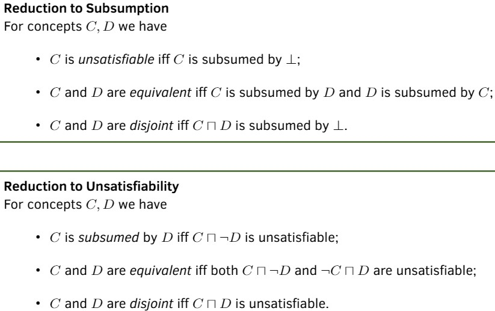
  * Translation to First Order Logic:
    * 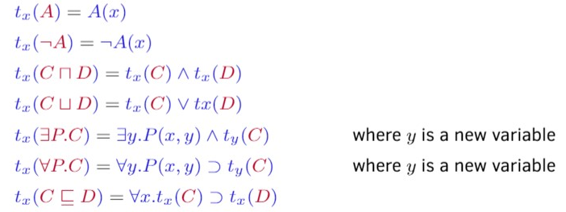
  * Web Ontology can be Description Logic Based or Rule based
* DL's advantage 
  * it is decidable nad less (time)-complex, has well-defined semantic
      * a lot of inference tasks
* DL's limitation, limitation of Description Logic:
  * 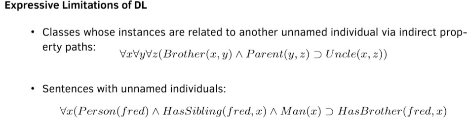
* Rule language:
  * head, body
  * 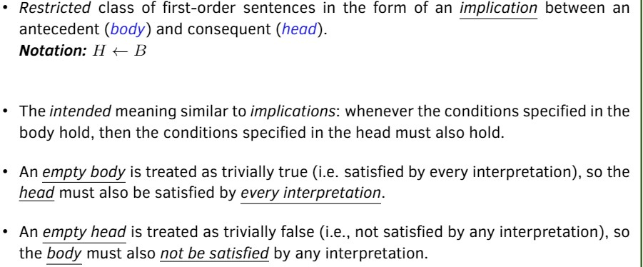
  * Horn-based Rule Language
    * 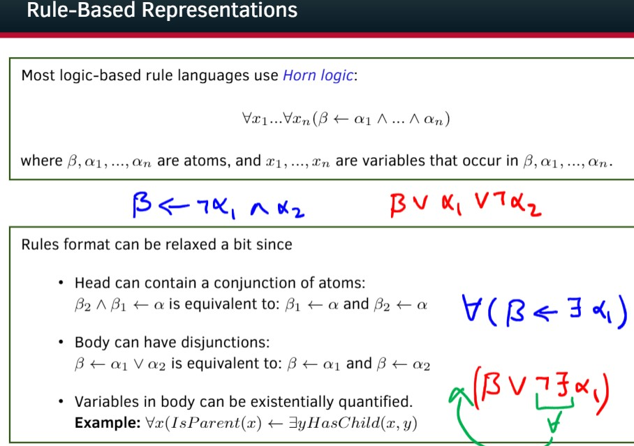
    * Expressive Limitation of Horn Rules
      * No disjunctions and existential quantifiers in the head.
      * No negation in the body
### Rules 
* a restricted FOL in implication form, mostly use Horn Logic
  * at most one positive literal when in clausal form
* Description Language vs. Rule Language
  * 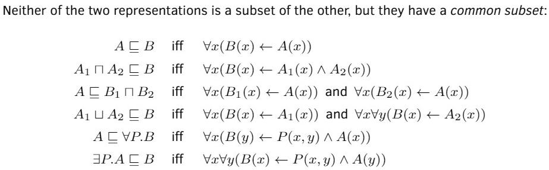
  * So combining two seems good
* Combining DL and Rules
  * Homogeneous Approaches: Tight Semantic Integration
    * make no distinction between two vocabulary; include both parts; sub parts have exactly same semantic as the original ones
    * Rules may be used for defining classes and ontologies 
    * Undecidable
      * solution: 
        * find a  subset of combined language that is still decidable, computable and expressive
          * DL-safe rules: variable only appear in non-DL-atom
    * Example:Semantic Web Rule Language (SWRL):
      * 
  * Hybrid Approaches: Strict Semantic separation
    * make distinction between rule predicates and ontology predicates
    * rule cannot be used to define classes and properties of ontologies
    * communication via safe interface
      * but interface is complicated
      * DL are mostly monotonic
      * efficient rule reasoner are not monotonic
        * but rules are non-monotonic -- we will have default and non-montonic reasoning again

## Diagnosis and Explanation
* Abductive Reasoning:
  * Given a KB and a formula β, abduce sufficient reasons for β to be true, with respect to the (implicit or explicit)facts in the KB.
  * Explanation Task: Given a KB and a observed formula $\beta$
    * what would be a sufficient reason for $\beta$ to be true
      * what would explain observed $\beta$ being true?
  * Diagnosis Task: Given a KB all of which in the following form
    * 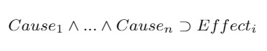
    * Find causes that best explain $\beta$
  * **Adequacy Criteria** for Explanations of $\alpha$ as an explanation of $\beta$ under KB
    * Also called 
    * sufficiency: $KB \cup \alpha \models \beta$ or $KB \models \alpha \supseteq \beta$
    * not rule out $KB \cup \alpha$ is consistent
    * $\alpha$ is as simple as possible
      * (syntactically) include as few terms as possible
    * $\alpha$ is in the appropriate vocabulary
      * usually we will have a set of Hypothesis (set of atomic sentences) with which explanation are phrased
      * hypothesis fix the vocabulary the explanation will use
  * Simplified Criteria for Propositional case
    * and look for explanation for atoms $p$
      * it is enough as we can add $p \equiv \beta$ into the KB and look for explanation of $p$
      * $KB \cup a \models b \iff KB \cup (P   \iff b), \alpha \models P$
    * because we are working on propositional case:
      * every explanation will be negation of clauses/conjunction of literals
        * 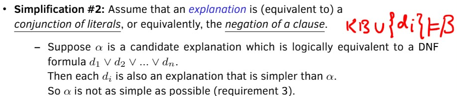
      * Thus we only need prime implicates
      * prime implicate for explanation
        * 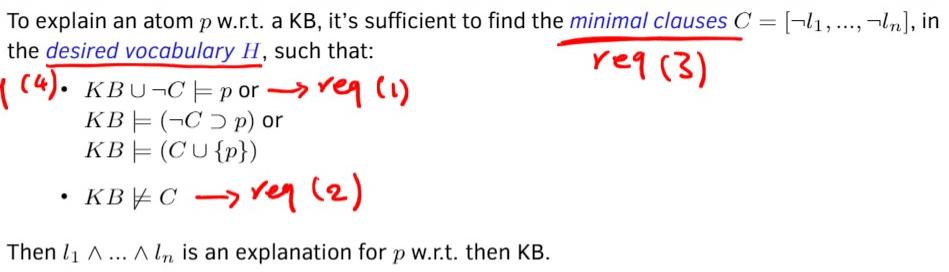
        * 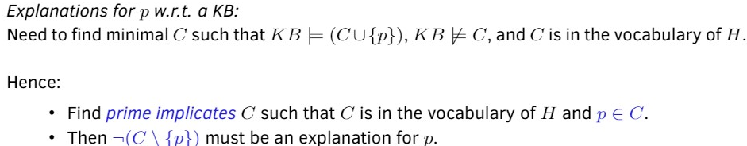
* Prime implicate
  * a clause $C$ s.t. $KB \models C$ and for all $C' \subsetneq C$, $KB \not \models C'$
  * minimal clause $KB$ entails
  * resolution is complete or propositional non-tautological prime implicates:
    * 
  * Algorithm to compute prime implicate:
    * 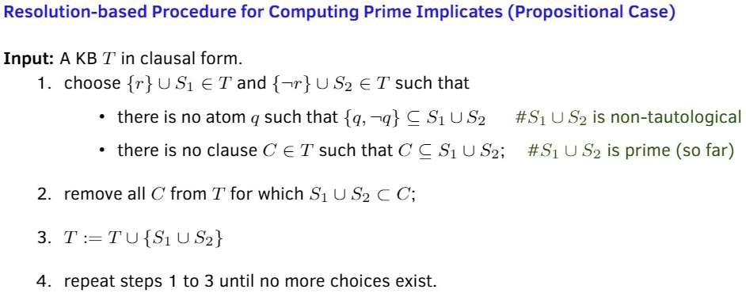
  * we can also compute validity/entailment using prime implicate
    * to query $KB \models A$ we just compute $KB$'s prime implicate and see if $A$ is inside
* Abductive Diagnosis: 
  * using abnormal behaviour (Fault Models) to compute if $KB \models$ (**entailed**) observed behaviour
  * then making a table, enumerating $Ab(b_i)$
    * 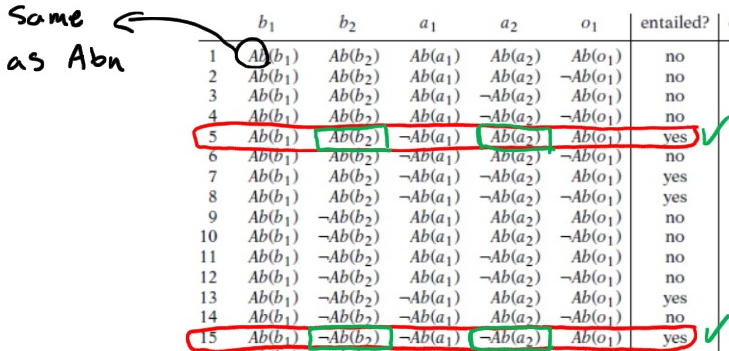
  * then checking the table
    * find a minimal conjunction of $Abn$ literals that entailment happens
    * example:
    * 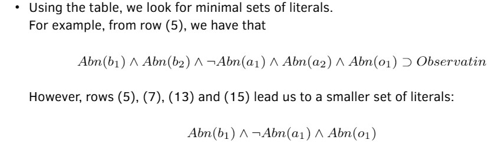
    * the other solutions include $Abn(b_1) \land \neg Abn(a_1) \land \neg Abn(a_2)$
      * $Abn(b_2) \land \neg Abn(a_1) \land \neg Abn(o_1)$
* Consistency-based Diagnosis:
  * similar, also considering fault models
  * but find those cases that **consistent** with observed behaviour
  * but find a minimal set of $D$
    * 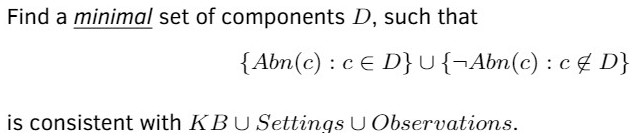
    * example:
    * 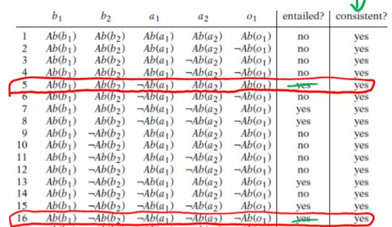
    * 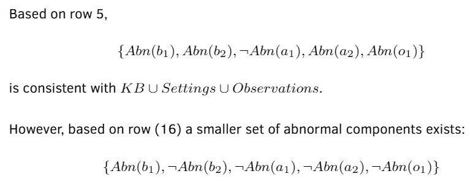