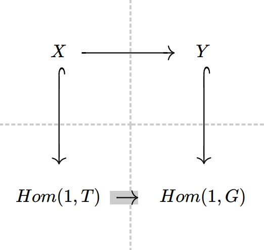
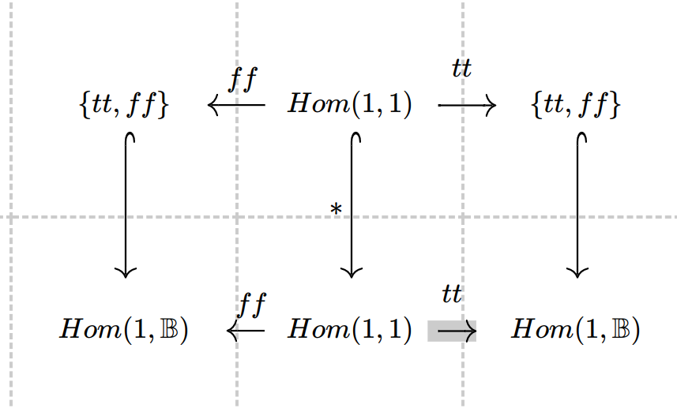
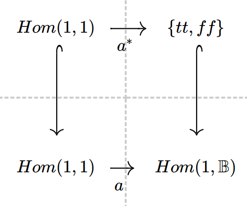

This post is to figure out 
1. indexed cat
2. fibration 
3. displayed cat
4. Theory of signature, including
5. displayed algebra
6. section of displayed algebra
7. family of presheaf

We list out there references:

**indexed cat and fibration** :
* [Catgeory of Containers](https://www.cs.le.ac.uk/people/ma139/docs/thesis.pdf)  Chapter 3 Thesis by Michael Gordon Abbott
 *  This is too category thereotic and I cannot yet find their advantage

**displayed cat**
* [Original Paper](https://arxiv.org/abs/1705.04296) by Benedikt Ahrens, Peter LeFanu Lumsdaine
* nlab : https://ncatlab.org/nlab/show/displayed+category 

**signature, displayed algebra, its section**
* [Constructing quotient inductive-inductive types](https://dl.acm.org/doi/10.1145/3290315) by Ambrus Kaposi, András Kovács,Thorsten Altenkirch

**Family of Presheaf** 
* Kaposi, Ambrus. Type theory in a type theory with quotient inductive types. Diss. University of Nottingham, 2017. 
  * Section 5.2.2
* Hofmann, Martin. "Syntax and semantics of dependent types." Extensional Constructs in Intensional Type Theory. Springer, London, 1997. 13-54.
  * Section 4.1

***
# Indexed Cat and Fibration
They are talked about in the earlier post 

# Displayed Cat

# Signature, Displayed Algebra, its section

## Theory of Signature
* "Constructing quotient inductive-inductive types" introduces the concept of theory of signature
* the theory of signature is an internal type theory (i.e. a type theory defined in an ambient type theory)

The motivation of introducing theory of signature is that,
* once we admit the theory of signature as a concrete QIIT type, then we can have all finite QIIT type
  * Just like once we have W-type, we have (can encode) all inductive type
* The trick is to use theory of signature to encode all kinds of signatures, and mapping signature to appropriate type for notions of algebra, algebra morphism and etc
* A concrete example is at Section 1.1, if we want equation inside signature, Section 1.2 is sufficient

## Displayed Algebra (over other algebra), and its section
Section 1.1 has roughly illustrated how displayed algebra looks like. Basically a predicate over type (as motive) and terms for 

For example, for `ℕ ≡ (N : 𝕌, zero : N , suc : N → N)` as a signature, we have its algebra `ℕᴬ ≡ ∑ N : Set, ∑ zero : N, ` (Note that ℕ is expressed inside theory of signature (an internal type theory), while ℕᴬ is a type in the ambient type theory)

Then for an algebra `a : ℕᴬ` a display algebra for a particular algebra `a`, would be `ℕᴰ(a) ≡ ∑ Nᴾ : N → Set, ∑ Nᴾ z, (x : N) → Nᴾ x → Nᴾ (succ x)`

One can see that, displayed algebra is basically just the "dependent part of the dependent pair". Or if I speak more clearly, `(∑ (a : ℕᴬ) . ℕᴰ(a)) : Set ` itself is an algebra. So basically it is a systematic and clearer concept when we do logical relation. 

The section is the required coherence condition to make it possible to have `f : ℕᴬ → (∑ (a : ℕᴬ) . ℕᴰ(a))` an algebra homomorphism, such that `π₁ ∘ f = id`. Roughly speaking, section is an appropriate

### Why is it called section? 
What's the relationship of this section with that section in the context of fibration?

## Family of Presheaf 
Family of presheaf is just a presheaf over elements of presheaf.
https://types.pl/@endexl/109327370483620195

***

# Gluing for type theory

Note that, [gluing for type theory](https://drops.dagstuhl.de/opus/volltexte/2019/10532/pdf/LIPIcs-FSCD-2019-25.pdf) is using indexed family instead of the comma category construction. These two are equivalent and intuitively speaking, the latter is talking a subset and the former is talking about a predicate. They should be equivalent.

> In the introduction we remarked that in categorical gluing an object in the glued model consists of a triple Γ : |S|, ∆ : |M| and a morphism M(∆, F Γ). We could follow this line and
define the gluing as a model with contexts such triples that comes with a strict “projection”
morphism to S. This could be called the fibrational or display map approach. Instead our
definition is more type theoretic, it uses indexed families, doubly (for the correspondence
between fibrations and families see e.g. [8, p. 221]). Firstly, the glued model is given as
a displayed model, that is, for each Γ : ConS i we have a set ConP i Γ. Secondly, instead
of setting ConP i Γ to (∆ : ConM i) × SubM ∆ (F Γ), we use the built-in notion of indexed
families in M, that is: types. Hence a context over Γ is an M-type in context F Γ. We
remark that the glueing construction also works with the former choice of contexts.

We don't distinguish these two in the following

## Canonicity Gluing Model, concretely

Recall how canonicity is glued. Basically we construct a comma category (in Set), 
* where objects are injection arrow to closed terms (i.e. subsets of closed terms)
* arrows are commutative diagrams

Of course, $T$ and $G$ are the objects of the original category (in our case, it is the syntax)---that means they can be either context or types.

Basically we need to make this construction for each part of the syntax.

One concrete example would be the gluing for boolean type, the diagram directly copied and pasted from Sterling's Thesis

Basically 
* we map the type `𝔹` to the glued construction: set of closed term `Hom(1, 𝔹)`, 
* and we also map the morphism (term) `tt, ff`  to the commutative diagram

We need to do complete this gluing construction for each part of the syntax, and come up with this model, just like compatibility lemma needs to be done for each typing rules

## How this model helps us

Once we complete the glue model, by initiallity of the syntax model (elimnation of the QIIT-syntax), we can have for a term `a : Tm ⋅ 𝔹` a following commutative diagram

Read out this diagram! It is in the `Set` category, where the two injection arrow are just subset. So read out it says `a* = a` for the above given `a`. However, `a* \in \{tt, ff\}`, so `a` is judgementally equal to either `tt` or `ff`.

## General Gluing Construction
This has been very clear in the ["Relative induction principles for type theories"](https://arxiv.org/abs/2102.11649)

>  The input of these general gluing constructions is a suitable functor `F : C → D`, where `C` is a syntactic model of type theory, and `D` is a semantic category (for instance a topos, or a model of another type theory with enough structure). Gluing
then provides a new glued model P of the type theory, that combines the syntax of `C` with
semantic information from D. Canonicity for instance can be proven by gluing along the global section functor `C → Set`. 

This maybe a little convoluted for the reader, but here our global section function is `Hom(1, -) : C → Set` and `D = Set`.

For our canonicity, gluing is just saying "'subset' of closed terms can construct a model" (in category theory we use injection to indicate subset anyway) 
  * where we need to choose a good subset at base type 

For normalization, gluing is just saying "'subset' of presheaf models can construct a model" (in category theory we use injection to indicate subset anyway) 
  * similarly we need  to choose normal form of boolean type when glue boolean, usually just Yoneda embedding

For Reynolds' Parametricity, the semantic category is pair of terms. And the 'subset' are the related pairs.
# Gluing is just a correct dependent elimination for syntax

Looking at [Constructing quotient inductive-inductive types](https://dl.acm.org/doi/10.1145/3290315), it has clearly specified how displayed algebra for syntax comes from uniary logical relation,

> `∆D (Nᴬ, zᴬ,sᴬ) ≡ (ND: Nᴬ → Set) × ND zᴬ × ((x : Nᴬ) → ND x → ND (sᴬ x))`
The operation `ND` is the unary logical predicate interpretation [Bernardy et al. 2012]: a context
Γ is interpreted as a predicate `ΓD : Γᴬ → Set`.

`ND` is just motive here. Catgeorical Gluing is saying we do a predicate on certain semantic. And here, this `ND` is a predicate on `Nᴬ` as the semantic of natural number `N`

So set theoretically speaking, gluing along a functor `F` is just constructing a model from subsets of `F(C)` where `C` is usually the syntax

Then we have this insight---dependent elimination is usually in a fixed style--- just like dependent elim is in a fixed style for function type, ***gluing for function type shoule be in a fixed style***!!!

Actually most types with universal property (i.e. equational rules on their intro/elim) should be glued in a fixed way, and the only flexibility locates at 
* the semantic category of the functor `F` (i.e. 'canonicity vs. normalization' as "closed term" vs. "presheaf model") 
* and the interpretation at base type (binary logical relation can relate weird stuff at base type) 